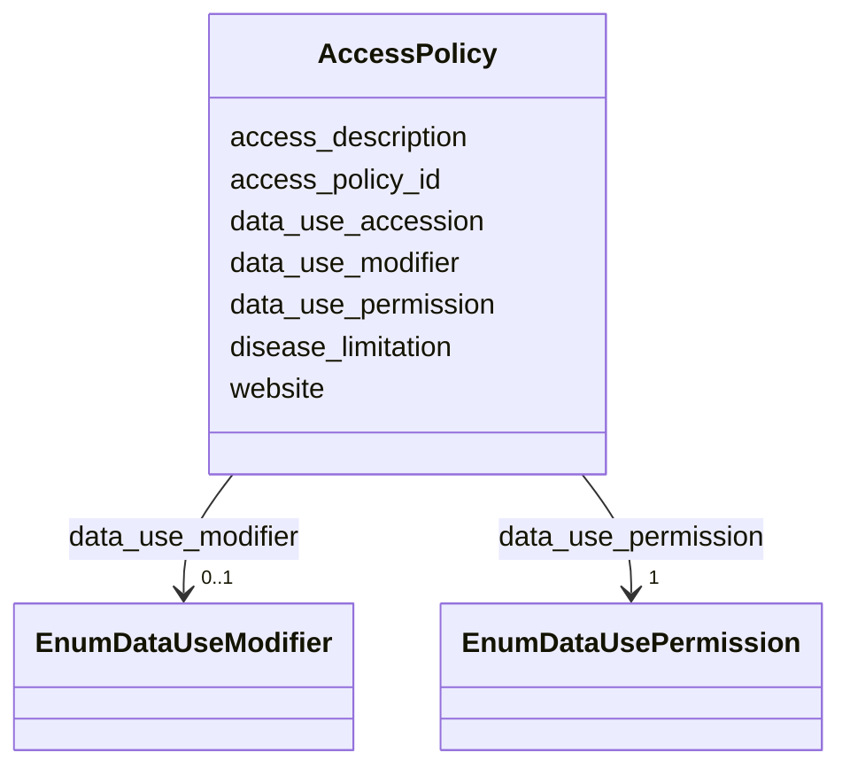

---
search:
  boost: 10.0
---

# Class: Access Policy (AccessPolicy) 


_The access policy that describes the controls around use of data_


<div data-search-exclude markdown="1">


URI: [acr_harmonized_data_model:AccessPolicy](https://w3id.org/anvilproject/acr-harmonized-data-model/AccessPolicy)





<!-- no inheritance hierarchy -->

## Slots

| Name | Cardinality and Range | Description | Inheritance |
| ---  | --- | --- | --- |
| [access_policy_id](access_policy_id.md) | 1 <br/> [CoGlobalID](CoGlobalID.md) | Global identifier for the access policy that applies to this row of data | direct |
| [data_use_accession](data_use_accession.md) | 0..1 <br/> [Uriorcurie](Uriorcurie.md) | Accession used to provision access to the record, eg, a dbGaP phsID | direct |
| [data_use_permission](data_use_permission.md) | 1 <br/> [EnumDataUsePermission](EnumDataUsePermission.md) | Broad category of restrictions on data use | direct |
| [data_use_modifier](data_use_modifier.md) | 0..1 <br/> [EnumDataUseModifier](EnumDataUseModifier.md) | Additional modifiers that limit data use | direct |
| [disease_limitation](disease_limitation.md) | 0..1 <br/> [String](String.md) | If the access is limited to a specific disease purpose, it is specified here | direct |
| [access_description](access_description.md) | 0..1 <br/> [String](String.md) | Any additional information to support access requests | direct |
| [website](website.md) | 0..1 <br/> [Uri](Uri.md) | Website with more information about this entity | direct |


## Usages

| used by | used in | type | used |
| ---  | --- | --- | --- |
| [Record](Record.md) | [access_policy_id](access_policy_id.md) | range | [AccessPolicy](AccessPolicy.md) |
| [Study](Study.md) | [access_policy_id](access_policy_id.md) | range | [AccessPolicy](AccessPolicy.md) |
| [StudyMetadata](StudyMetadata.md) | [access_policy_id](access_policy_id.md) | range | [AccessPolicy](AccessPolicy.md) |
| [VirtualBiorepository](VirtualBiorepository.md) | [access_policy_id](access_policy_id.md) | range | [AccessPolicy](AccessPolicy.md) |
| [DOI](DOI.md) | [access_policy_id](access_policy_id.md) | range | [AccessPolicy](AccessPolicy.md) |
| [Investigator](Investigator.md) | [access_policy_id](access_policy_id.md) | range | [AccessPolicy](AccessPolicy.md) |
| [Publication](Publication.md) | [access_policy_id](access_policy_id.md) | range | [AccessPolicy](AccessPolicy.md) |
| [Subject](Subject.md) | [access_policy_id](access_policy_id.md) | range | [AccessPolicy](AccessPolicy.md) |
| [Demographics](Demographics.md) | [access_policy_id](access_policy_id.md) | range | [AccessPolicy](AccessPolicy.md) |
| [Family](Family.md) | [access_policy_id](access_policy_id.md) | range | [AccessPolicy](AccessPolicy.md) |
| [FamilyRelationship](FamilyRelationship.md) | [access_policy_id](access_policy_id.md) | range | [AccessPolicy](AccessPolicy.md) |
| [FamilyMembership](FamilyMembership.md) | [access_policy_id](access_policy_id.md) | range | [AccessPolicy](AccessPolicy.md) |
| [SubjectAssertion](SubjectAssertion.md) | [access_policy_id](access_policy_id.md) | range | [AccessPolicy](AccessPolicy.md) |
| [Sample](Sample.md) | [access_policy_id](access_policy_id.md) | range | [AccessPolicy](AccessPolicy.md) |
| [BiospecimenCollection](BiospecimenCollection.md) | [access_policy_id](access_policy_id.md) | range | [AccessPolicy](AccessPolicy.md) |
| [Aliquot](Aliquot.md) | [access_policy_id](access_policy_id.md) | range | [AccessPolicy](AccessPolicy.md) |
| [Encounter](Encounter.md) | [access_policy_id](access_policy_id.md) | range | [AccessPolicy](AccessPolicy.md) |
| [EncounterDefinition](EncounterDefinition.md) | [access_policy_id](access_policy_id.md) | range | [AccessPolicy](AccessPolicy.md) |
| [ActivityDefinition](ActivityDefinition.md) | [access_policy_id](access_policy_id.md) | range | [AccessPolicy](AccessPolicy.md) |
| [File](File.md) | [access_policy_id](access_policy_id.md) | range | [AccessPolicy](AccessPolicy.md) |
| [Assay](Assay.md) | [access_policy_id](access_policy_id.md) | range | [AccessPolicy](AccessPolicy.md) |


## Identifier and Mapping Information


### Schema Source


* from schema: https://w3id.org/anvilproject/acr-harmonized-data-model


## Mappings

| Mapping Type | Mapped Value |
| ---  | ---  |
| self | acr_harmonized_data_model:AccessPolicy |
| native | acr_harmonized_data_model:AccessPolicy |


## LinkML Source

<!-- TODO: investigate https://stackoverflow.com/questions/37606292/how-to-create-tabbed-code-blocks-in-mkdocs-or-sphinx -->

### Direct

<details>
```yaml
name: AccessPolicy
description: The access policy that describes the controls around use of data
title: Access Policy
from_schema: https://w3id.org/anvilproject/acr-harmonized-data-model
slots:
- access_policy_id
- data_use_accession
- data_use_permission
- data_use_modifier
- disease_limitation
- access_description
- website
slot_usage:
  access_policy_id:
    name: access_policy_id
    identifier: true
    range: coGlobalID
    required: true

```
</details>

### Induced

<details>
```yaml
name: AccessPolicy
description: The access policy that describes the controls around use of data
title: Access Policy
from_schema: https://w3id.org/anvilproject/acr-harmonized-data-model
slot_usage:
  access_policy_id:
    name: access_policy_id
    identifier: true
    range: coGlobalID
    required: true
attributes:
  access_policy_id:
    name: access_policy_id
    description: Global identifier for the access policy that applies to this row
      of data.
    title: Access Policy ID
    from_schema: https://w3id.org/anvilproject/acr-harmonized-data-model
    rank: 1000
    identifier: true
    owner: AccessPolicy
    domain_of:
    - Record
    - AccessPolicy
    range: coGlobalID
    required: true
  data_use_accession:
    name: data_use_accession
    description: Accession used to provision access to the record, eg, a dbGaP phsID.
    title: Data Use Accession
    from_schema: https://w3id.org/anvilproject/acr-harmonized-data-model
    rank: 1000
    owner: AccessPolicy
    domain_of:
    - AccessPolicy
    range: uriorcurie
  data_use_permission:
    name: data_use_permission
    description: Broad category of restrictions on data use.
    title: Data Use Permission
    from_schema: https://w3id.org/anvilproject/acr-harmonized-data-model
    rank: 1000
    owner: AccessPolicy
    domain_of:
    - AccessPolicy
    range: EnumDataUsePermission
    required: true
  data_use_modifier:
    name: data_use_modifier
    description: Additional modifiers that limit data use.
    title: Data Use Modifier
    from_schema: https://w3id.org/anvilproject/acr-harmonized-data-model
    rank: 1000
    owner: AccessPolicy
    domain_of:
    - AccessPolicy
    range: EnumDataUseModifier
  disease_limitation:
    name: disease_limitation
    description: If the access is limited to a specific disease purpose, it is specified
      here.
    title: Data Use Disease Limitation
    from_schema: https://w3id.org/anvilproject/acr-harmonized-data-model
    rank: 1000
    owner: AccessPolicy
    domain_of:
    - AccessPolicy
    range: string
  access_description:
    name: access_description
    description: Any additional information to support access requests.
    title: Access Description
    from_schema: https://w3id.org/anvilproject/acr-harmonized-data-model
    rank: 1000
    owner: AccessPolicy
    domain_of:
    - AccessPolicy
    range: string
  website:
    name: website
    description: Website with more information about this entity.
    title: Website
    from_schema: https://w3id.org/anvilproject/acr-harmonized-data-model
    rank: 1000
    owner: AccessPolicy
    domain_of:
    - AccessPolicy
    - Study
    - VirtualBiorepository
    - Publication
    range: uri

```
</details></div>