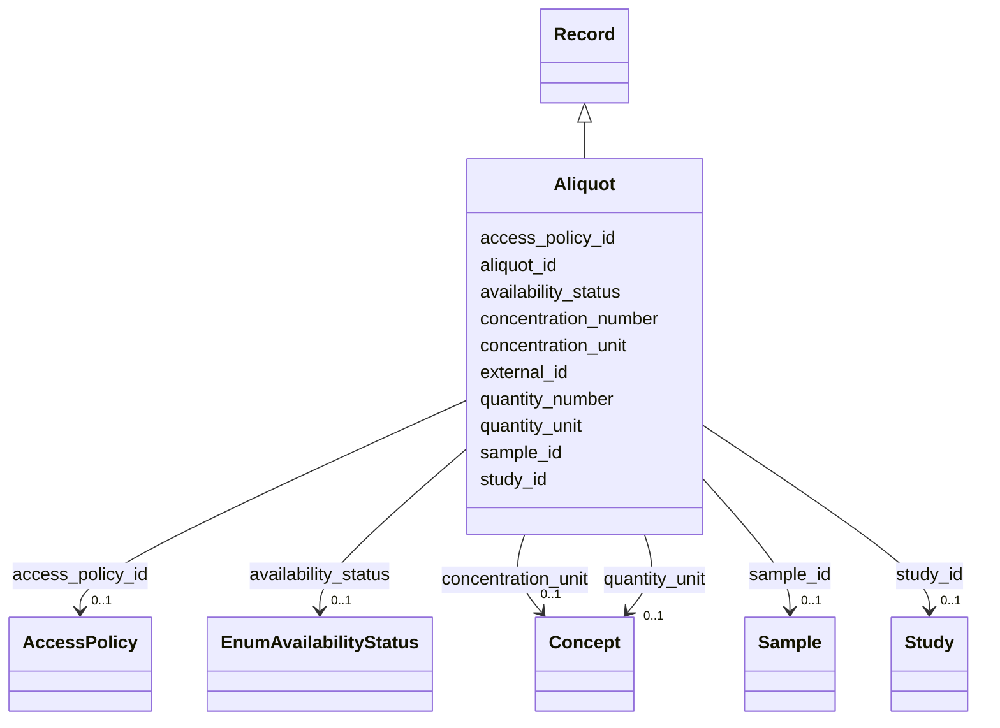

---
search:
  boost: 10.0
---

# Class: Aliquot (Aliquot) 


_A specific tube or amount of a biospecimen associated with a Sample._


<div data-search-exclude markdown="1">


URI: [acr_harmonized_data_model:Aliquot](https://w3id.org/anvilproject/acr-harmonized-data-model/Aliquot)





## Inheritance
* **Aliquot** [ [Record](Record.md)]


## Slots

| Name | Cardinality and Range | Description | Inheritance |
| ---  | --- | --- | --- |
| [aliquot_id](aliquot_id.md) | 1 <br/> [String](String.md) | Unique identifier for an Aliquot | direct |
| [sample_id](sample_id.md) | 0..1 <br/> [Sample](Sample.md) | The unique identifier for this Sample | direct |
| [availability_status](availability_status.md) | 0..1 <br/> [EnumAvailabilityStatus](EnumAvailabilityStatus.md) | Can this Sample be requested for further analysis? | direct |
| [quantity_number](quantity_number.md) | 0..1 <br/> [Float](Float.md) | The total quantity of the specimen | direct |
| [quantity_unit](quantity_unit.md) | 0..1 <br/> [Concept](Concept.md) | The structured term defining the units of the quantity | direct |
| [concentration_number](concentration_number.md) | 0..1 <br/> [Float](Float.md) | What is the concentration of the analyte in the Aliquot? | direct |
| [concentration_unit](concentration_unit.md) | 0..1 <br/> [Concept](Concept.md) | Units associated with the concentration of the analyte in the Aliquot | direct |
| [external_id](external_id.md) | * <br/> [Uriorcurie](Uriorcurie.md) | Other identifiers for this entity, eg, from the submitting study or in system... | [Record](Record.md) |
| [access_policy_id](access_policy_id.md) | 0..1 <br/> [AccessPolicy](AccessPolicy.md) | Global identifier for the access policy that applies to this row of data | [Record](Record.md) |
| [study_id](study_id.md) | 0..1 <br/> [Study](Study.md) | INCLUDE Global ID for the study | [Record](Record.md) |


## Identifier and Mapping Information


### Schema Source


* from schema: https://w3id.org/anvilproject/acr-harmonized-data-model


## Mappings

| Mapping Type | Mapped Value |
| ---  | ---  |
| self | acr_harmonized_data_model:Aliquot |
| native | acr_harmonized_data_model:Aliquot |


## LinkML Source

<!-- TODO: investigate https://stackoverflow.com/questions/37606292/how-to-create-tabbed-code-blocks-in-mkdocs-or-sphinx -->

### Direct

<details>
```yaml
name: Aliquot
description: A specific tube or amount of a biospecimen associated with a Sample.
title: Aliquot
from_schema: https://w3id.org/anvilproject/acr-harmonized-data-model
mixins:
- Record
slots:
- aliquot_id
- sample_id
- availability_status
- quantity_number
- quantity_unit
- concentration_number
- concentration_unit
slot_usage:
  aliquot_id:
    name: aliquot_id
    identifier: true
    range: string
    required: true

```
</details>

### Induced

<details>
```yaml
name: Aliquot
description: A specific tube or amount of a biospecimen associated with a Sample.
title: Aliquot
from_schema: https://w3id.org/anvilproject/acr-harmonized-data-model
mixins:
- Record
slot_usage:
  aliquot_id:
    name: aliquot_id
    identifier: true
    range: string
    required: true
attributes:
  aliquot_id:
    name: aliquot_id
    description: Unique identifier for an Aliquot.
    title: Aliquot ID
    from_schema: https://w3id.org/anvilproject/acr-harmonized-data-model
    rank: 1000
    identifier: true
    owner: Aliquot
    domain_of:
    - Aliquot
    range: string
    required: true
  sample_id:
    name: sample_id
    description: The unique identifier for this Sample.
    title: Sample ID
    from_schema: https://w3id.org/anvilproject/acr-harmonized-data-model
    rank: 1000
    owner: Aliquot
    domain_of:
    - Sample
    - Aliquot
    - File
    - Assay
    range: Sample
  availability_status:
    name: availability_status
    description: Can this Sample be requested for further analysis?
    title: Sample Availability
    from_schema: https://w3id.org/anvilproject/acr-harmonized-data-model
    rank: 1000
    owner: Aliquot
    domain_of:
    - Sample
    - Aliquot
    range: EnumAvailabilityStatus
  quantity_number:
    name: quantity_number
    description: The total quantity of the specimen
    title: Quantity
    from_schema: https://w3id.org/anvilproject/acr-harmonized-data-model
    rank: 1000
    owner: Aliquot
    domain_of:
    - Sample
    - Aliquot
    range: float
  quantity_unit:
    name: quantity_unit
    description: The structured term defining the units of the quantity.
    title: Quantity Units
    from_schema: https://w3id.org/anvilproject/acr-harmonized-data-model
    rank: 1000
    owner: Aliquot
    domain_of:
    - Sample
    - Aliquot
    range: Concept
  concentration_number:
    name: concentration_number
    description: What is the concentration of the analyte in the Aliquot?
    title: Concentration
    from_schema: https://w3id.org/anvilproject/acr-harmonized-data-model
    rank: 1000
    owner: Aliquot
    domain_of:
    - Aliquot
    range: float
  concentration_unit:
    name: concentration_unit
    description: Units associated with the concentration of the analyte in the Aliquot.
    title: Concentration Units
    from_schema: https://w3id.org/anvilproject/acr-harmonized-data-model
    rank: 1000
    owner: Aliquot
    domain_of:
    - Aliquot
    range: Concept
  external_id:
    name: external_id
    description: Other identifiers for this entity, eg, from the submitting study
      or in systems like dbGaP
    title: External Identifiers
    from_schema: https://w3id.org/anvilproject/acr-harmonized-data-model
    rank: 1000
    owner: Aliquot
    domain_of:
    - Record
    range: uriorcurie
    required: false
    multivalued: true
  access_policy_id:
    name: access_policy_id
    description: Global identifier for the access policy that applies to this row
      of data.
    title: Access Policy ID
    from_schema: https://w3id.org/anvilproject/acr-harmonized-data-model
    rank: 1000
    owner: Aliquot
    domain_of:
    - Record
    - AccessPolicy
    range: AccessPolicy
  study_id:
    name: study_id
    description: INCLUDE Global ID for the study
    title: Study ID
    from_schema: https://w3id.org/anvilproject/acr-harmonized-data-model
    rank: 1000
    owner: Aliquot
    domain_of:
    - Record
    - StudyMetadata
    range: Study
    multivalued: false

```
</details></div>