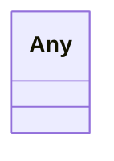

---
search:
  boost: 10.0
---

# Class: Any 

<div data-search-exclude markdown="1">


URI: [linkml:Any](https://w3id.org/linkml/Any)





<!-- no inheritance hierarchy -->

## Class Properties

| Property | Value |
| --- | --- |
| Class URI | [linkml:Any](https://w3id.org/linkml/Any) |


## Slots

| Name | Cardinality and Range | Description | Inheritance |
| ---  | --- | --- | --- |


## Identifier and Mapping Information


### Schema Source


* from schema: https://w3id.org/anvilproject/acr-harmonized-data-model


## Mappings

| Mapping Type | Mapped Value |
| ---  | ---  |
| self | linkml:Any |
| native | acr_harmonized_data_model:Any |


## LinkML Source

<!-- TODO: investigate https://stackoverflow.com/questions/37606292/how-to-create-tabbed-code-blocks-in-mkdocs-or-sphinx -->

### Direct

<details>
```yaml
name: Any
from_schema: https://w3id.org/anvilproject/acr-harmonized-data-model
class_uri: linkml:Any

```
</details>

### Induced

<details>
```yaml
name: Any
from_schema: https://w3id.org/anvilproject/acr-harmonized-data-model
class_uri: linkml:Any

```
</details></div>