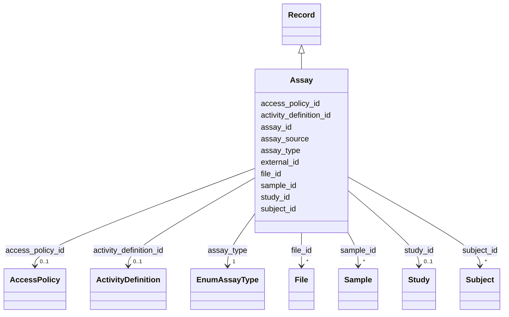

---
search:
  boost: 10.0
---

# Class: Assay (Assay) 


_A specific assay that was performed on given subject(s) or sample(s)._


<div data-search-exclude markdown="1">


URI: [acr_harmonized_data_model:Assay](https://w3id.org/anvilproject/acr-harmonized-data-model/Assay)





## Inheritance
* **Assay** [ [Record](Record.md)]


## Slots

| Name | Cardinality and Range | Description | Inheritance |
| ---  | --- | --- | --- |
| [assay_id](assay_id.md) | 1 <br/> [DiGlobalID](DiGlobalID.md) | The unique identifier for the Assay | direct |
| [subject_id](subject_id.md) | * <br/> [Subject](Subject.md) | INCLUDE Global ID for the Subject | direct |
| [sample_id](sample_id.md) | * <br/> [Sample](Sample.md) | The unique identifier for this Sample | direct |
| [file_id](file_id.md) | * <br/> [File](File.md) | Unique identifier for this File | direct |
| [assay_type](assay_type.md) | 1 <br/> [EnumAssayType](EnumAssayType.md) | The type of assay performed | direct |
| [assay_source](assay_source.md) | 0..1 <br/> [String](String.md) | The original description of the Assay performed | direct |
| [activity_definition_id](activity_definition_id.md) | 0..1 <br/> [ActivityDefinition](ActivityDefinition.md) | Unique identifier for this Activity Definition | direct |
| [external_id](external_id.md) | * <br/> [Uriorcurie](Uriorcurie.md) | Other identifiers for this entity, eg, from the submitting study or in system... | [Record](Record.md) |
| [access_policy_id](access_policy_id.md) | 0..1 <br/> [AccessPolicy](AccessPolicy.md) | Global identifier for the access policy that applies to this row of data | [Record](Record.md) |
| [study_id](study_id.md) | 0..1 <br/> [Study](Study.md) | INCLUDE Global ID for the study | [Record](Record.md) |


## Identifier and Mapping Information


### Schema Source


* from schema: https://w3id.org/anvilproject/acr-harmonized-data-model


## Mappings

| Mapping Type | Mapped Value |
| ---  | ---  |
| self | acr_harmonized_data_model:Assay |
| native | acr_harmonized_data_model:Assay |


## LinkML Source

<!-- TODO: investigate https://stackoverflow.com/questions/37606292/how-to-create-tabbed-code-blocks-in-mkdocs-or-sphinx -->

### Direct

<details>
```yaml
name: Assay
description: A specific assay that was performed on given subject(s) or sample(s).
title: Assay
from_schema: https://w3id.org/anvilproject/acr-harmonized-data-model
mixins:
- Record
slots:
- assay_id
- subject_id
- sample_id
- file_id
- assay_type
- assay_source
- activity_definition_id
slot_usage:
  assay_id:
    name: assay_id
    identifier: true
    range: diGlobalID
    required: true
  file_id:
    name: file_id
    multivalued: true
  subject_id:
    name: subject_id
    multivalued: true
  sample_id:
    name: sample_id
    multivalued: true
  assay_type:
    name: assay_type
    required: true

```
</details>

### Induced

<details>
```yaml
name: Assay
description: A specific assay that was performed on given subject(s) or sample(s).
title: Assay
from_schema: https://w3id.org/anvilproject/acr-harmonized-data-model
mixins:
- Record
slot_usage:
  assay_id:
    name: assay_id
    identifier: true
    range: diGlobalID
    required: true
  file_id:
    name: file_id
    multivalued: true
  subject_id:
    name: subject_id
    multivalued: true
  sample_id:
    name: sample_id
    multivalued: true
  assay_type:
    name: assay_type
    required: true
attributes:
  assay_id:
    name: assay_id
    description: The unique identifier for the Assay.
    title: Assay ID
    from_schema: https://w3id.org/anvilproject/acr-harmonized-data-model
    rank: 1000
    identifier: true
    owner: Assay
    domain_of:
    - Assay
    range: diGlobalID
    required: true
  subject_id:
    name: subject_id
    description: INCLUDE Global ID for the Subject
    title: Study ID
    from_schema: https://w3id.org/anvilproject/acr-harmonized-data-model
    rank: 1000
    owner: Assay
    domain_of:
    - Subject
    - Demographics
    - FamilyRelationship
    - FamilyMembership
    - SubjectAssertion
    - Encounter
    - File
    - Assay
    range: Subject
    multivalued: true
  sample_id:
    name: sample_id
    description: The unique identifier for this Sample.
    title: Sample ID
    from_schema: https://w3id.org/anvilproject/acr-harmonized-data-model
    rank: 1000
    owner: Assay
    domain_of:
    - Sample
    - Aliquot
    - File
    - Assay
    range: Sample
    multivalued: true
  file_id:
    name: file_id
    description: Unique identifier for this File.
    title: File ID
    from_schema: https://w3id.org/anvilproject/acr-harmonized-data-model
    rank: 1000
    owner: Assay
    domain_of:
    - File
    - Assay
    - Dataset
    range: File
    multivalued: true
  assay_type:
    name: assay_type
    description: The type of assay performed.
    title: Assay Type
    from_schema: https://w3id.org/anvilproject/acr-harmonized-data-model
    rank: 1000
    owner: Assay
    domain_of:
    - Assay
    range: EnumAssayType
    required: true
  assay_source:
    name: assay_source
    description: The original description of the Assay performed.
    title: Assay Source Text
    from_schema: https://w3id.org/anvilproject/acr-harmonized-data-model
    rank: 1000
    owner: Assay
    domain_of:
    - Assay
    range: string
  activity_definition_id:
    name: activity_definition_id
    description: Unique identifier for this Activity Definition.
    title: Activity Definition ID
    from_schema: https://w3id.org/anvilproject/acr-harmonized-data-model
    rank: 1000
    owner: Assay
    domain_of:
    - EncounterDefinition
    - ActivityDefinition
    - Assay
    range: ActivityDefinition
  external_id:
    name: external_id
    description: Other identifiers for this entity, eg, from the submitting study
      or in systems like dbGaP
    title: External Identifiers
    from_schema: https://w3id.org/anvilproject/acr-harmonized-data-model
    rank: 1000
    owner: Assay
    domain_of:
    - Record
    range: uriorcurie
    required: false
    multivalued: true
  access_policy_id:
    name: access_policy_id
    description: Global identifier for the access policy that applies to this row
      of data.
    title: Access Policy ID
    from_schema: https://w3id.org/anvilproject/acr-harmonized-data-model
    rank: 1000
    owner: Assay
    domain_of:
    - Record
    - AccessPolicy
    range: AccessPolicy
  study_id:
    name: study_id
    description: INCLUDE Global ID for the study
    title: Study ID
    from_schema: https://w3id.org/anvilproject/acr-harmonized-data-model
    rank: 1000
    owner: Assay
    domain_of:
    - Record
    - StudyMetadata
    range: Study
    multivalued: false

```
</details></div>