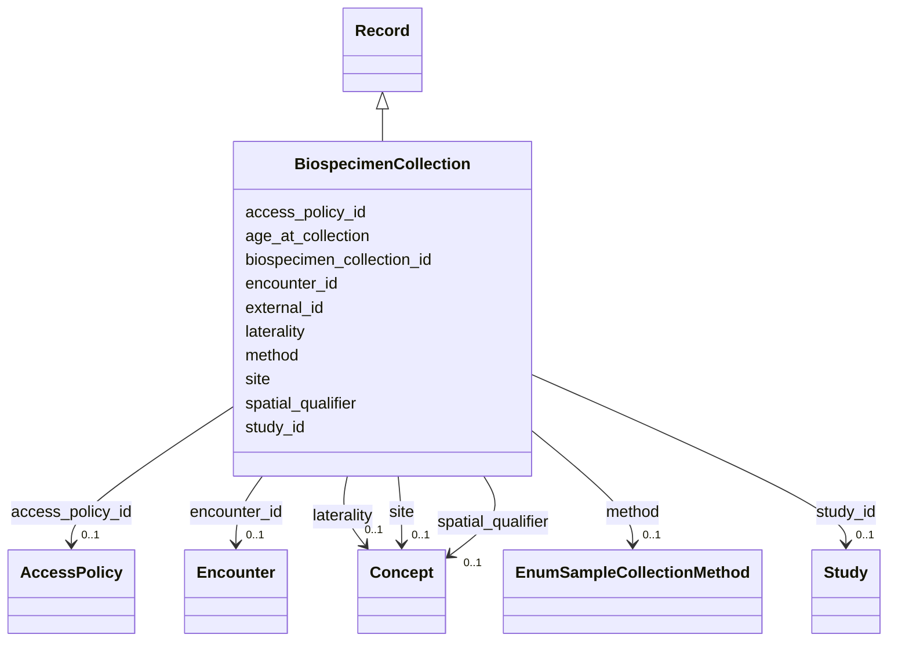

---
search:
  boost: 10.0
---

# Class: BiospecimenCollection (BiospecimenCollection) 


_A biospecimen collection event which yields one or more Samples._


<div data-search-exclude markdown="1">


URI: [acr_harmonized_data_model:BiospecimenCollection](https://w3id.org/anvilproject/acr-harmonized-data-model/BiospecimenCollection)





## Inheritance
* **BiospecimenCollection** [ [Record](Record.md)]


## Slots

| Name | Cardinality and Range | Description | Inheritance |
| ---  | --- | --- | --- |
| [biospecimen_collection_id](biospecimen_collection_id.md) | 1 <br/> [String](String.md) | Unique identifier for this Biospecimen Collection | direct |
| [age_at_collection](age_at_collection.md) | 0..1 <br/> [Float](Float.md) | The age at which this biospecimen was collected in decimal years | direct |
| [method](method.md) | 0..1 <br/> [EnumSampleCollectionMethod](EnumSampleCollectionMethod.md) | The approach used to collect the biospecimen | direct |
| [site](site.md) | 0..1 <br/> [Concept](Concept.md)&nbsp;or&nbsp;<br />[EnumSite](EnumSite.md) | The location of the specimen collection | direct |
| [spatial_qualifier](spatial_qualifier.md) | 0..1 <br/> [Concept](Concept.md)&nbsp;or&nbsp;<br />[EnumSpatialQualifiers](EnumSpatialQualifiers.md) | Qualifier that further refine the specific location of biospecimen collection | direct |
| [laterality](laterality.md) | 0..1 <br/> [Concept](Concept.md)&nbsp;or&nbsp;<br />[EnumLaterality](EnumLaterality.md) | Laterality that further refine the specific location of biospecimen collectio... | direct |
| [encounter_id](encounter_id.md) | 0..1 <br/> [Encounter](Encounter.md) | Unique identifier for this Encounter | direct |
| [external_id](external_id.md) | * <br/> [Uriorcurie](Uriorcurie.md) | Other identifiers for this entity, eg, from the submitting study or in system... | [Record](Record.md) |
| [access_policy_id](access_policy_id.md) | 0..1 <br/> [AccessPolicy](AccessPolicy.md) | Global identifier for the access policy that applies to this row of data | [Record](Record.md) |
| [study_id](study_id.md) | 0..1 <br/> [Study](Study.md) | INCLUDE Global ID for the study | [Record](Record.md) |


## Usages

| used by | used in | type | used |
| ---  | --- | --- | --- |
| [Sample](Sample.md) | [biospecimen_collection_id](biospecimen_collection_id.md) | range | [BiospecimenCollection](BiospecimenCollection.md) |


## Identifier and Mapping Information


### Schema Source


* from schema: https://w3id.org/anvilproject/acr-harmonized-data-model


## Mappings

| Mapping Type | Mapped Value |
| ---  | ---  |
| self | acr_harmonized_data_model:BiospecimenCollection |
| native | acr_harmonized_data_model:BiospecimenCollection |


## LinkML Source

<!-- TODO: investigate https://stackoverflow.com/questions/37606292/how-to-create-tabbed-code-blocks-in-mkdocs-or-sphinx -->

### Direct

<details>
```yaml
name: BiospecimenCollection
description: A biospecimen collection event which yields one or more Samples.
title: BiospecimenCollection
from_schema: https://w3id.org/anvilproject/acr-harmonized-data-model
mixins:
- Record
slots:
- biospecimen_collection_id
- age_at_collection
- method
- site
- spatial_qualifier
- laterality
- encounter_id
slot_usage:
  biospecimen_collection_id:
    name: biospecimen_collection_id
    identifier: true
    range: string
    required: true

```
</details>

### Induced

<details>
```yaml
name: BiospecimenCollection
description: A biospecimen collection event which yields one or more Samples.
title: BiospecimenCollection
from_schema: https://w3id.org/anvilproject/acr-harmonized-data-model
mixins:
- Record
slot_usage:
  biospecimen_collection_id:
    name: biospecimen_collection_id
    identifier: true
    range: string
    required: true
attributes:
  biospecimen_collection_id:
    name: biospecimen_collection_id
    description: Unique identifier for this Biospecimen Collection.
    title: Biospecimen Collection ID
    from_schema: https://w3id.org/anvilproject/acr-harmonized-data-model
    rank: 1000
    identifier: true
    owner: BiospecimenCollection
    domain_of:
    - Sample
    - BiospecimenCollection
    range: string
    required: true
  age_at_collection:
    name: age_at_collection
    description: The age at which this biospecimen was collected in decimal years.
    title: Age at Biospecimen Collection
    from_schema: https://w3id.org/anvilproject/acr-harmonized-data-model
    rank: 1000
    owner: BiospecimenCollection
    domain_of:
    - BiospecimenCollection
    range: float
    unit:
      ucum_code: a
  method:
    name: method
    description: The approach used to collect the biospecimen.
    title: Biospecimen Collection Method
    from_schema: https://w3id.org/anvilproject/acr-harmonized-data-model
    rank: 1000
    owner: BiospecimenCollection
    domain_of:
    - BiospecimenCollection
    range: EnumSampleCollectionMethod
  site:
    name: site
    description: The location of the specimen collection.
    title: Biospecimen Collection Site
    from_schema: https://w3id.org/anvilproject/acr-harmonized-data-model
    rank: 1000
    owner: BiospecimenCollection
    domain_of:
    - BiospecimenCollection
    range: Concept
    any_of:
    - range: Concept
    - range: EnumSite
  spatial_qualifier:
    name: spatial_qualifier
    description: Qualifier that further refine the specific location of biospecimen
      collection
    title: Spatial Qualifier
    from_schema: https://w3id.org/anvilproject/acr-harmonized-data-model
    rank: 1000
    owner: BiospecimenCollection
    domain_of:
    - BiospecimenCollection
    range: Concept
    any_of:
    - range: Concept
    - range: EnumSpatialQualifiers
  laterality:
    name: laterality
    description: Laterality that further refine the specific location of biospecimen
      collection
    title: Location Laterality
    from_schema: https://w3id.org/anvilproject/acr-harmonized-data-model
    rank: 1000
    owner: BiospecimenCollection
    domain_of:
    - BiospecimenCollection
    range: Concept
    any_of:
    - range: Concept
    - range: EnumLaterality
  encounter_id:
    name: encounter_id
    description: Unique identifier for this Encounter.
    title: Encounter ID
    from_schema: https://w3id.org/anvilproject/acr-harmonized-data-model
    rank: 1000
    owner: BiospecimenCollection
    domain_of:
    - SubjectAssertion
    - BiospecimenCollection
    - Encounter
    range: Encounter
  external_id:
    name: external_id
    description: Other identifiers for this entity, eg, from the submitting study
      or in systems like dbGaP
    title: External Identifiers
    from_schema: https://w3id.org/anvilproject/acr-harmonized-data-model
    rank: 1000
    owner: BiospecimenCollection
    domain_of:
    - Record
    range: uriorcurie
    required: false
    multivalued: true
  access_policy_id:
    name: access_policy_id
    description: Global identifier for the access policy that applies to this row
      of data.
    title: Access Policy ID
    from_schema: https://w3id.org/anvilproject/acr-harmonized-data-model
    rank: 1000
    owner: BiospecimenCollection
    domain_of:
    - Record
    - AccessPolicy
    range: AccessPolicy
  study_id:
    name: study_id
    description: INCLUDE Global ID for the study
    title: Study ID
    from_schema: https://w3id.org/anvilproject/acr-harmonized-data-model
    rank: 1000
    owner: BiospecimenCollection
    domain_of:
    - Record
    - StudyMetadata
    range: Study
    multivalued: false

```
</details></div>