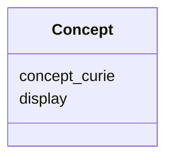

---
search:
  boost: 10.0
---

# Class: Concept (Concept) 


_A standardized concept with display information._


<div data-search-exclude markdown="1">


URI: [acr_harmonized_data_model:Concept](https://w3id.org/anvilproject/acr-harmonized-data-model/Concept)





<!-- no inheritance hierarchy -->

## Slots

| Name | Cardinality and Range | Description | Inheritance |
| ---  | --- | --- | --- |
| [concept_curie](concept_curie.md) | 1 <br/> [Uriorcurie](Uriorcurie.md) | The standardized curie for the term | direct |
| [display](display.md) | 0..1 <br/> [String](String.md) | The friendly display string of the coded term | direct |


## Usages

| used by | used in | type | used |
| ---  | --- | --- | --- |
| [StudyMetadata](StudyMetadata.md) | [study_design](study_design.md) | range | [Concept](Concept.md) |
| [StudyMetadata](StudyMetadata.md) | [study_design](study_design.md) | any_of[range] | [Concept](Concept.md) |
| [StudyMetadata](StudyMetadata.md) | [data_category](data_category.md) | range | [Concept](Concept.md) |
| [StudyMetadata](StudyMetadata.md) | [data_category](data_category.md) | any_of[range] | [Concept](Concept.md) |
| [StudyMetadata](StudyMetadata.md) | [research_domain](research_domain.md) | range | [Concept](Concept.md) |
| [StudyMetadata](StudyMetadata.md) | [research_domain](research_domain.md) | any_of[range] | [Concept](Concept.md) |
| [Subject](Subject.md) | [subject_type](subject_type.md) | range | [Concept](Concept.md) |
| [Demographics](Demographics.md) | [sex](sex.md) | range | [Concept](Concept.md) |
| [Demographics](Demographics.md) | [race](race.md) | range | [Concept](Concept.md) |
| [Demographics](Demographics.md) | [ethnicity](ethnicity.md) | range | [Concept](Concept.md) |
| [Demographics](Demographics.md) | [vital_status](vital_status.md) | range | [Concept](Concept.md) |
| [FamilyRelationship](FamilyRelationship.md) | [relation](relation.md) | range | [Concept](Concept.md) |
| [FamilyMembership](FamilyMembership.md) | [family_role](family_role.md) | range | [Concept](Concept.md) |
| [FamilyMembership](FamilyMembership.md) | [family_role](family_role.md) | any_of[range] | [Concept](Concept.md) |
| [SubjectAssertion](SubjectAssertion.md) | [concept](concept.md) | range | [Concept](Concept.md) |
| [SubjectAssertion](SubjectAssertion.md) | [value_concept](value_concept.md) | range | [Concept](Concept.md) |
| [SubjectAssertion](SubjectAssertion.md) | [value_concept](value_concept.md) | any_of[range] | [Concept](Concept.md) |
| [SubjectAssertion](SubjectAssertion.md) | [value_unit](value_unit.md) | range | [Concept](Concept.md) |
| [Sample](Sample.md) | [quantity_unit](quantity_unit.md) | range | [Concept](Concept.md) |
| [BiospecimenCollection](BiospecimenCollection.md) | [site](site.md) | range | [Concept](Concept.md) |
| [BiospecimenCollection](BiospecimenCollection.md) | [site](site.md) | any_of[range] | [Concept](Concept.md) |
| [BiospecimenCollection](BiospecimenCollection.md) | [spatial_qualifier](spatial_qualifier.md) | range | [Concept](Concept.md) |
| [BiospecimenCollection](BiospecimenCollection.md) | [spatial_qualifier](spatial_qualifier.md) | any_of[range] | [Concept](Concept.md) |
| [BiospecimenCollection](BiospecimenCollection.md) | [laterality](laterality.md) | range | [Concept](Concept.md) |
| [BiospecimenCollection](BiospecimenCollection.md) | [laterality](laterality.md) | any_of[range] | [Concept](Concept.md) |
| [Aliquot](Aliquot.md) | [quantity_unit](quantity_unit.md) | range | [Concept](Concept.md) |
| [Aliquot](Aliquot.md) | [concentration_unit](concentration_unit.md) | range | [Concept](Concept.md) |
| [File](File.md) | [data_category](data_category.md) | range | [Concept](Concept.md) |
| [File](File.md) | [data_category](data_category.md) | any_of[range] | [Concept](Concept.md) |


## Identifier and Mapping Information


### Schema Source


* from schema: https://w3id.org/anvilproject/acr-harmonized-data-model


## Mappings

| Mapping Type | Mapped Value |
| ---  | ---  |
| self | acr_harmonized_data_model:Concept |
| native | acr_harmonized_data_model:Concept |


## LinkML Source

<!-- TODO: investigate https://stackoverflow.com/questions/37606292/how-to-create-tabbed-code-blocks-in-mkdocs-or-sphinx -->

### Direct

<details>
```yaml
name: Concept
description: A standardized concept with display information.
title: Concept
from_schema: https://w3id.org/anvilproject/acr-harmonized-data-model
slots:
- concept_curie
- display
slot_usage:
  concept_curie:
    name: concept_curie
    identifier: true
    required: true

```
</details>

### Induced

<details>
```yaml
name: Concept
description: A standardized concept with display information.
title: Concept
from_schema: https://w3id.org/anvilproject/acr-harmonized-data-model
slot_usage:
  concept_curie:
    name: concept_curie
    identifier: true
    required: true
attributes:
  concept_curie:
    name: concept_curie
    description: The standardized curie for the term.
    title: Concept Curie
    from_schema: https://w3id.org/anvilproject/acr-harmonized-data-model
    rank: 1000
    identifier: true
    owner: Concept
    domain_of:
    - Concept
    range: uriorcurie
    required: true
  display:
    name: display
    description: The friendly display string of the coded term.
    title: Display String
    from_schema: https://w3id.org/anvilproject/acr-harmonized-data-model
    rank: 1000
    owner: Concept
    domain_of:
    - Concept
    range: string

```
</details></div>