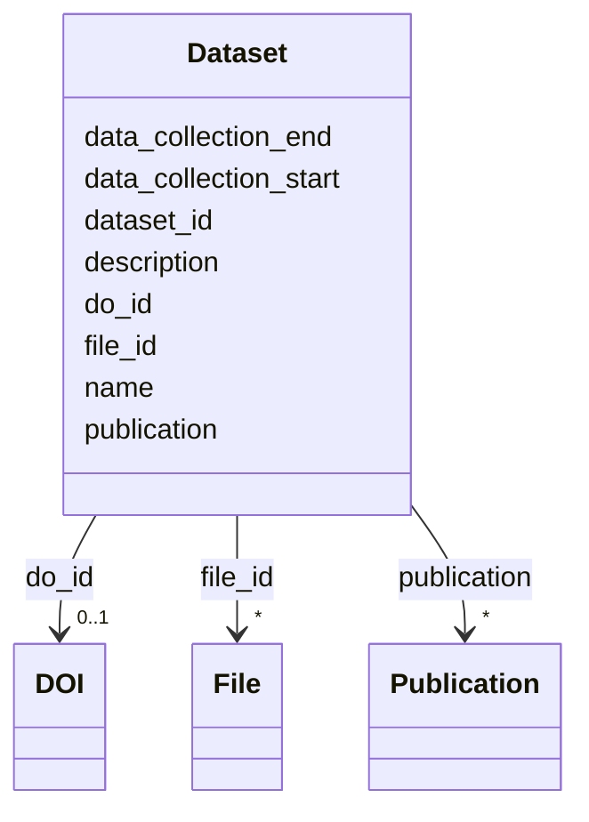

---
search:
  boost: 10.0
---

# Class: Dataset (Dataset) 


_Set of files grouped together for release._


<div data-search-exclude markdown="1">


URI: [acr_harmonized_data_model:Dataset](https://w3id.org/anvilproject/acr-harmonized-data-model/Dataset)





<!-- no inheritance hierarchy -->

## Slots

| Name | Cardinality and Range | Description | Inheritance |
| ---  | --- | --- | --- |
| [dataset_id](dataset_id.md) | 1 <br/> [LsGlobalID](LsGlobalID.md) | Unique identifier for a Dataset | direct |
| [name](name.md) | 0..1 <br/> [String](String.md) | Name of the entity | direct |
| [description](description.md) | 0..1 <br/> [String](String.md) | Description for this entity | direct |
| [do_id](do_id.md) | 0..1 <br/> [DOI](DOI.md) | Digital Object Identifier (DOI) for this Record | direct |
| [file_id](file_id.md) | * <br/> [File](File.md) | The list of files comprising this dataset | direct |
| [publication](publication.md) | * <br/> [Publication](Publication.md) | Publications associated with this Record | direct |
| [data_collection_start](data_collection_start.md) | 0..1 <br/> [String](String.md) | The date that data collection started | direct |
| [data_collection_end](data_collection_end.md) | 0..1 <br/> [String](String.md) | The date that data collection started | direct |


## Identifier and Mapping Information


### Schema Source


* from schema: https://w3id.org/anvilproject/acr-harmonized-data-model


## Mappings

| Mapping Type | Mapped Value |
| ---  | ---  |
| self | acr_harmonized_data_model:Dataset |
| native | acr_harmonized_data_model:Dataset |


## LinkML Source

<!-- TODO: investigate https://stackoverflow.com/questions/37606292/how-to-create-tabbed-code-blocks-in-mkdocs-or-sphinx -->

### Direct

<details>
```yaml
name: Dataset
description: Set of files grouped together for release.
title: Dataset
from_schema: https://w3id.org/anvilproject/acr-harmonized-data-model
slots:
- dataset_id
- name
- description
- do_id
- file_id
- publication
- data_collection_start
- data_collection_end
slot_usage:
  dataset_id:
    name: dataset_id
    identifier: true
    range: lsGlobalID
    required: true
  file_id:
    name: file_id
    description: The list of files comprising this dataset.
    multivalued: true

```
</details>

### Induced

<details>
```yaml
name: Dataset
description: Set of files grouped together for release.
title: Dataset
from_schema: https://w3id.org/anvilproject/acr-harmonized-data-model
slot_usage:
  dataset_id:
    name: dataset_id
    identifier: true
    range: lsGlobalID
    required: true
  file_id:
    name: file_id
    description: The list of files comprising this dataset.
    multivalued: true
attributes:
  dataset_id:
    name: dataset_id
    description: Unique identifier for a Dataset.
    title: Dataset ID
    from_schema: https://w3id.org/anvilproject/acr-harmonized-data-model
    rank: 1000
    identifier: true
    owner: Dataset
    domain_of:
    - Dataset
    range: lsGlobalID
    required: true
  name:
    name: name
    description: Name of the entity.
    title: Name
    from_schema: https://w3id.org/anvilproject/acr-harmonized-data-model
    rank: 1000
    owner: Dataset
    domain_of:
    - VirtualBiorepository
    - Investigator
    - EncounterDefinition
    - ActivityDefinition
    - Dataset
    range: string
    required: false
  description:
    name: description
    description: Description for this entity.
    title: Description
    from_schema: https://w3id.org/anvilproject/acr-harmonized-data-model
    rank: 1000
    owner: Dataset
    domain_of:
    - EncounterDefinition
    - ActivityDefinition
    - Dataset
    range: string
  do_id:
    name: do_id
    description: Digital Object Identifier (DOI) for this Record.
    title: DOI
    from_schema: https://w3id.org/anvilproject/acr-harmonized-data-model
    rank: 1000
    owner: Dataset
    domain_of:
    - Study
    - DOI
    - Dataset
    range: DOI
    multivalued: false
  file_id:
    name: file_id
    description: The list of files comprising this dataset.
    title: File ID
    from_schema: https://w3id.org/anvilproject/acr-harmonized-data-model
    rank: 1000
    owner: Dataset
    domain_of:
    - File
    - Assay
    - Dataset
    range: File
    multivalued: true
  publication:
    name: publication
    description: Publications associated with this Record.
    title: Publication
    from_schema: https://w3id.org/anvilproject/acr-harmonized-data-model
    rank: 1000
    owner: Dataset
    domain_of:
    - Study
    - Dataset
    range: Publication
    multivalued: true
  data_collection_start:
    name: data_collection_start
    description: The date that data collection started. May include only a year.
    title: Data Collection Start
    from_schema: https://w3id.org/anvilproject/acr-harmonized-data-model
    rank: 1000
    owner: Dataset
    domain_of:
    - Dataset
    range: string
  data_collection_end:
    name: data_collection_end
    description: The date that data collection started. May include only a year.
    title: Data Collection End
    from_schema: https://w3id.org/anvilproject/acr-harmonized-data-model
    rank: 1000
    owner: Dataset
    domain_of:
    - Dataset
    range: string

```
</details></div>