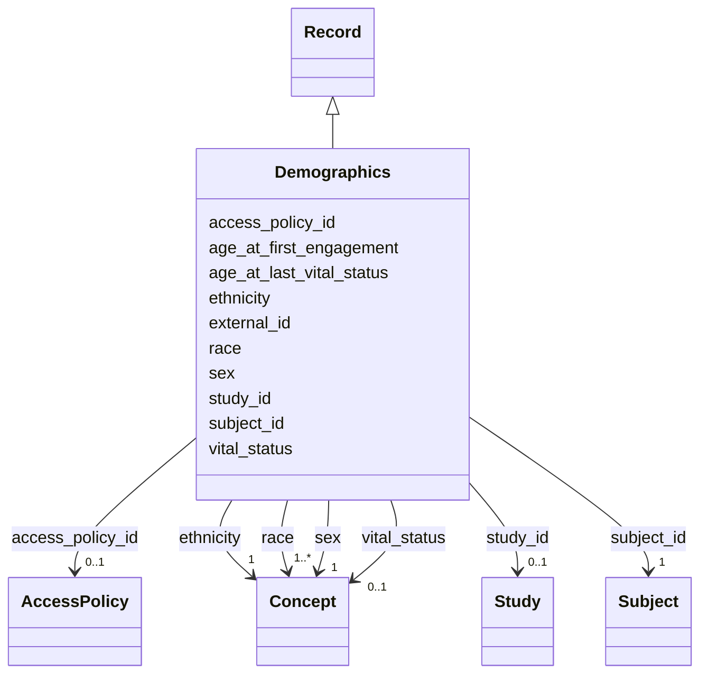

---
search:
  boost: 10.0
---

# Class: Demographics (Demographics) 


_Basic participant demographics summary_


<div data-search-exclude markdown="1">


URI: [acr_harmonized_data_model:Demographics](https://w3id.org/anvilproject/acr-harmonized-data-model/Demographics)





## Inheritance
* **Demographics** [ [Record](Record.md)]


## Slots

| Name | Cardinality and Range | Description | Inheritance |
| ---  | --- | --- | --- |
| [subject_id](subject_id.md) | 1 <br/> [Subject](Subject.md) | INCLUDE Global ID for the Subject | direct |
| [sex](sex.md) | 1 <br/> [Concept](Concept.md)&nbsp;or&nbsp;<br />[EnumSex](EnumSex.md)&nbsp;or&nbsp;<br />[EnumUnknownOther](EnumUnknownOther.md) | Sex of Participant | direct |
| [race](race.md) | 1..* <br/> [Concept](Concept.md)&nbsp;or&nbsp;<br />[EnumRace](EnumRace.md)&nbsp;or&nbsp;<br />[EnumUnknownOther](EnumUnknownOther.md) | Race of Participant | direct |
| [ethnicity](ethnicity.md) | 1 <br/> [Concept](Concept.md)&nbsp;or&nbsp;<br />[EnumEthnicity](EnumEthnicity.md)&nbsp;or&nbsp;<br />[EnumUnknownOther](EnumUnknownOther.md) | Ethnicity of Participant | direct |
| [age_at_last_vital_status](age_at_last_vital_status.md) | 0..1 <br/> [Integer](Integer.md) | Age in days when participant's vital status was last recorded | direct |
| [vital_status](vital_status.md) | 0..1 <br/> [Concept](Concept.md)&nbsp;or&nbsp;<br />[EnumVitalStatus](EnumVitalStatus.md)&nbsp;or&nbsp;<br />[EnumUnknown](EnumUnknown.md) | Whether participant is alive or dead | direct |
| [age_at_first_engagement](age_at_first_engagement.md) | 0..1 <br/> [Integer](Integer.md) | Age in days of Participant at first recorded study event (enrollment, visit, ... | direct |
| [external_id](external_id.md) | * <br/> [Uriorcurie](Uriorcurie.md) | Other identifiers for this entity, eg, from the submitting study or in system... | [Record](Record.md) |
| [access_policy_id](access_policy_id.md) | 0..1 <br/> [AccessPolicy](AccessPolicy.md) | Global identifier for the access policy that applies to this row of data | [Record](Record.md) |
| [study_id](study_id.md) | 0..1 <br/> [Study](Study.md) | INCLUDE Global ID for the study | [Record](Record.md) |


## Identifier and Mapping Information


### Schema Source


* from schema: https://w3id.org/anvilproject/acr-harmonized-data-model


## Mappings

| Mapping Type | Mapped Value |
| ---  | ---  |
| self | acr_harmonized_data_model:Demographics |
| native | acr_harmonized_data_model:Demographics |


## LinkML Source

<!-- TODO: investigate https://stackoverflow.com/questions/37606292/how-to-create-tabbed-code-blocks-in-mkdocs-or-sphinx -->

### Direct

<details>
```yaml
name: Demographics
description: Basic participant demographics summary
title: Demographics
from_schema: https://w3id.org/anvilproject/acr-harmonized-data-model
mixins:
- Record
slots:
- subject_id
- sex
- race
- ethnicity
- age_at_last_vital_status
- vital_status
- age_at_first_engagement
slot_usage:
  subject_id:
    name: subject_id
    identifier: true
    required: true

```
</details>

### Induced

<details>
```yaml
name: Demographics
description: Basic participant demographics summary
title: Demographics
from_schema: https://w3id.org/anvilproject/acr-harmonized-data-model
mixins:
- Record
slot_usage:
  subject_id:
    name: subject_id
    identifier: true
    required: true
attributes:
  subject_id:
    name: subject_id
    description: INCLUDE Global ID for the Subject
    title: Study ID
    from_schema: https://w3id.org/anvilproject/acr-harmonized-data-model
    rank: 1000
    identifier: true
    owner: Demographics
    domain_of:
    - Subject
    - Demographics
    - FamilyRelationship
    - FamilyMembership
    - SubjectAssertion
    - Encounter
    - File
    - Assay
    range: Subject
    required: true
    multivalued: false
  sex:
    name: sex
    description: Sex of Participant
    title: Sex
    from_schema: https://w3id.org/anvilproject/acr-harmonized-data-model
    rank: 1000
    owner: Demographics
    domain_of:
    - Demographics
    range: Concept
    required: true
    any_of:
    - range: EnumSex
    - range: EnumUnknownOther
  race:
    name: race
    description: Race of Participant
    title: Race
    from_schema: https://w3id.org/anvilproject/acr-harmonized-data-model
    rank: 1000
    owner: Demographics
    domain_of:
    - Demographics
    range: Concept
    required: true
    multivalued: true
    any_of:
    - range: EnumRace
    - range: EnumUnknownOther
  ethnicity:
    name: ethnicity
    description: Ethnicity of Participant
    title: Ethnicity
    from_schema: https://w3id.org/anvilproject/acr-harmonized-data-model
    rank: 1000
    owner: Demographics
    domain_of:
    - Demographics
    range: Concept
    required: true
    any_of:
    - range: EnumEthnicity
    - range: EnumUnknownOther
  age_at_last_vital_status:
    name: age_at_last_vital_status
    description: Age in days when participant's vital status was last recorded
    title: Age at Last Vital Status
    from_schema: https://w3id.org/anvilproject/acr-harmonized-data-model
    rank: 1000
    owner: Demographics
    domain_of:
    - Demographics
    range: integer
    minimum_value: -365
    maximum_value: 32507
    unit:
      ucum_code: d
  vital_status:
    name: vital_status
    description: Whether participant is alive or dead
    title: Vital Status
    from_schema: https://w3id.org/anvilproject/acr-harmonized-data-model
    rank: 1000
    owner: Demographics
    domain_of:
    - Demographics
    range: Concept
    any_of:
    - range: EnumVitalStatus
    - range: EnumUnknown
  age_at_first_engagement:
    name: age_at_first_engagement
    description: Age in days of Participant at first recorded study event (enrollment,
      visit, observation, sample collection, survey completion, etc.). Age at enrollment
      is preferred, if available.
    title: Age at First Participant Engagement
    from_schema: https://w3id.org/anvilproject/acr-harmonized-data-model
    rank: 1000
    owner: Demographics
    domain_of:
    - Demographics
    range: integer
    minimum_value: -365
    maximum_value: 32507
    unit:
      ucum_code: d
  external_id:
    name: external_id
    description: Other identifiers for this entity, eg, from the submitting study
      or in systems like dbGaP
    title: External Identifiers
    from_schema: https://w3id.org/anvilproject/acr-harmonized-data-model
    rank: 1000
    owner: Demographics
    domain_of:
    - Record
    range: uriorcurie
    required: false
    multivalued: true
  access_policy_id:
    name: access_policy_id
    description: Global identifier for the access policy that applies to this row
      of data.
    title: Access Policy ID
    from_schema: https://w3id.org/anvilproject/acr-harmonized-data-model
    rank: 1000
    owner: Demographics
    domain_of:
    - Record
    - AccessPolicy
    range: AccessPolicy
  study_id:
    name: study_id
    description: INCLUDE Global ID for the study
    title: Study ID
    from_schema: https://w3id.org/anvilproject/acr-harmonized-data-model
    rank: 1000
    owner: Demographics
    domain_of:
    - Record
    - StudyMetadata
    range: Study
    multivalued: false

```
</details></div>