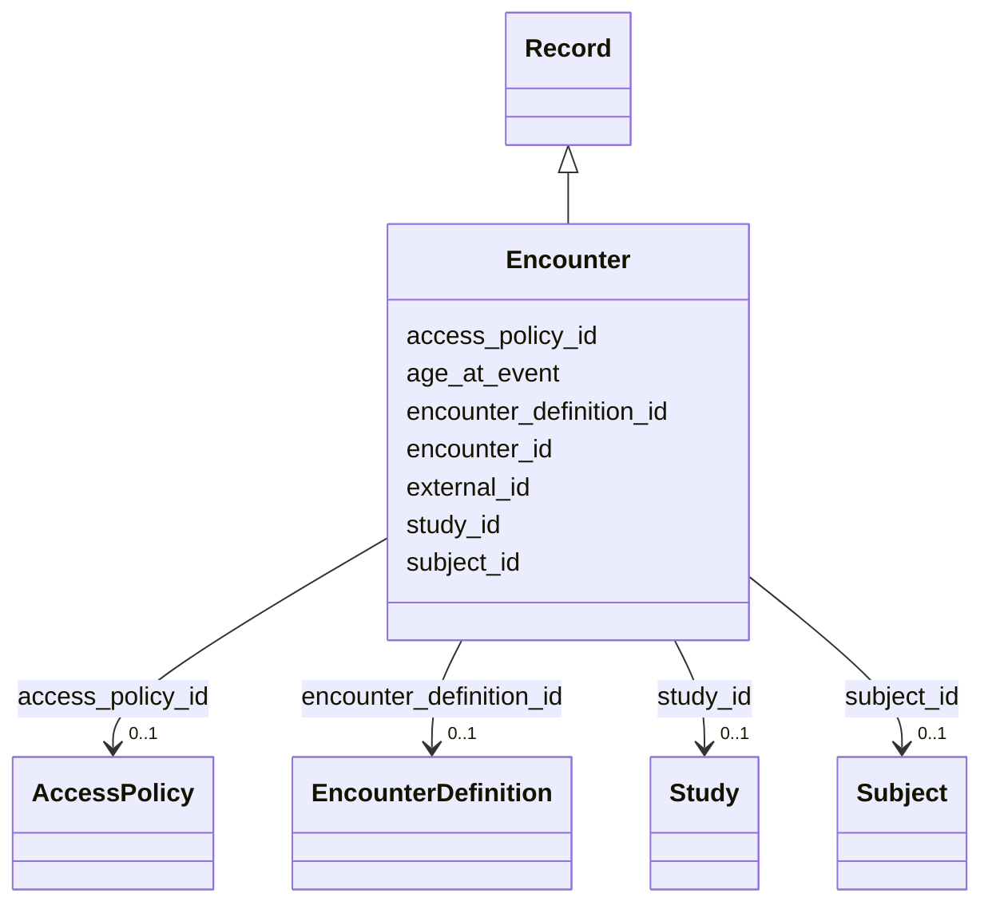

---
search:
  boost: 10.0
---

# Class: Participant Encounter (Encounter) 


_An event at which data was collected about a participant, an intervention was made, or information about a participant was recorded._


<div data-search-exclude markdown="1">


URI: [acr_harmonized_data_model:Encounter](https://w3id.org/anvilproject/acr-harmonized-data-model/Encounter)





## Inheritance
* **Encounter** [ [Record](Record.md)]


## Slots

| Name | Cardinality and Range | Description | Inheritance |
| ---  | --- | --- | --- |
| [encounter_id](encounter_id.md) | 1 <br/> [EnGlobalID](EnGlobalID.md) | Unique identifier for this Encounter | direct |
| [subject_id](subject_id.md) | 0..1 <br/> [Subject](Subject.md) | INCLUDE Global ID for the Subject | direct |
| [encounter_definition_id](encounter_definition_id.md) | 0..1 <br/> [EncounterDefinition](EncounterDefinition.md) | Unique identifier for this Encounter Definition | direct |
| [age_at_event](age_at_event.md) | 0..1 <br/> [Integer](Integer.md) | The age in days of the Subject at the time point which the assertion describe... | direct |
| [external_id](external_id.md) | * <br/> [Uriorcurie](Uriorcurie.md) | Other identifiers for this entity, eg, from the submitting study or in system... | [Record](Record.md) |
| [access_policy_id](access_policy_id.md) | 0..1 <br/> [AccessPolicy](AccessPolicy.md) | Global identifier for the access policy that applies to this row of data | [Record](Record.md) |
| [study_id](study_id.md) | 0..1 <br/> [Study](Study.md) | INCLUDE Global ID for the study | [Record](Record.md) |


## Usages

| used by | used in | type | used |
| ---  | --- | --- | --- |
| [SubjectAssertion](SubjectAssertion.md) | [encounter_id](encounter_id.md) | range | [Encounter](Encounter.md) |
| [BiospecimenCollection](BiospecimenCollection.md) | [encounter_id](encounter_id.md) | range | [Encounter](Encounter.md) |


## Identifier and Mapping Information


### Schema Source


* from schema: https://w3id.org/anvilproject/acr-harmonized-data-model


## Mappings

| Mapping Type | Mapped Value |
| ---  | ---  |
| self | acr_harmonized_data_model:Encounter |
| native | acr_harmonized_data_model:Encounter |


## LinkML Source

<!-- TODO: investigate https://stackoverflow.com/questions/37606292/how-to-create-tabbed-code-blocks-in-mkdocs-or-sphinx -->

### Direct

<details>
```yaml
name: Encounter
description: An event at which data was collected about a participant, an intervention
  was made, or information about a participant was recorded.
title: Participant Encounter
from_schema: https://w3id.org/anvilproject/acr-harmonized-data-model
mixins:
- Record
slots:
- encounter_id
- subject_id
- encounter_definition_id
- age_at_event
slot_usage:
  encounter_id:
    name: encounter_id
    identifier: true
    range: enGlobalID
    required: true

```
</details>

### Induced

<details>
```yaml
name: Encounter
description: An event at which data was collected about a participant, an intervention
  was made, or information about a participant was recorded.
title: Participant Encounter
from_schema: https://w3id.org/anvilproject/acr-harmonized-data-model
mixins:
- Record
slot_usage:
  encounter_id:
    name: encounter_id
    identifier: true
    range: enGlobalID
    required: true
attributes:
  encounter_id:
    name: encounter_id
    description: Unique identifier for this Encounter.
    title: Encounter ID
    from_schema: https://w3id.org/anvilproject/acr-harmonized-data-model
    rank: 1000
    identifier: true
    owner: Encounter
    domain_of:
    - SubjectAssertion
    - BiospecimenCollection
    - Encounter
    range: enGlobalID
    required: true
  subject_id:
    name: subject_id
    description: INCLUDE Global ID for the Subject
    title: Study ID
    from_schema: https://w3id.org/anvilproject/acr-harmonized-data-model
    rank: 1000
    owner: Encounter
    domain_of:
    - Subject
    - Demographics
    - FamilyRelationship
    - FamilyMembership
    - SubjectAssertion
    - Encounter
    - File
    - Assay
    range: Subject
    multivalued: false
  encounter_definition_id:
    name: encounter_definition_id
    description: Unique identifier for this Encounter Definition.
    title: Encounter Definition ID
    from_schema: https://w3id.org/anvilproject/acr-harmonized-data-model
    rank: 1000
    owner: Encounter
    domain_of:
    - Encounter
    - EncounterDefinition
    range: EncounterDefinition
  age_at_event:
    name: age_at_event
    description: The age in days of the Subject at the time point which the assertion
      describes, eg, age of onset or when a measurement was performed.
    title: Age at event
    from_schema: https://w3id.org/anvilproject/acr-harmonized-data-model
    rank: 1000
    owner: Encounter
    domain_of:
    - SubjectAssertion
    - Encounter
    range: integer
    unit:
      ucum_code: d
  external_id:
    name: external_id
    description: Other identifiers for this entity, eg, from the submitting study
      or in systems like dbGaP
    title: External Identifiers
    from_schema: https://w3id.org/anvilproject/acr-harmonized-data-model
    rank: 1000
    owner: Encounter
    domain_of:
    - Record
    range: uriorcurie
    required: false
    multivalued: true
  access_policy_id:
    name: access_policy_id
    description: Global identifier for the access policy that applies to this row
      of data.
    title: Access Policy ID
    from_schema: https://w3id.org/anvilproject/acr-harmonized-data-model
    rank: 1000
    owner: Encounter
    domain_of:
    - Record
    - AccessPolicy
    range: AccessPolicy
  study_id:
    name: study_id
    description: INCLUDE Global ID for the study
    title: Study ID
    from_schema: https://w3id.org/anvilproject/acr-harmonized-data-model
    rank: 1000
    owner: Encounter
    domain_of:
    - Record
    - StudyMetadata
    range: Study
    multivalued: false

```
</details></div>