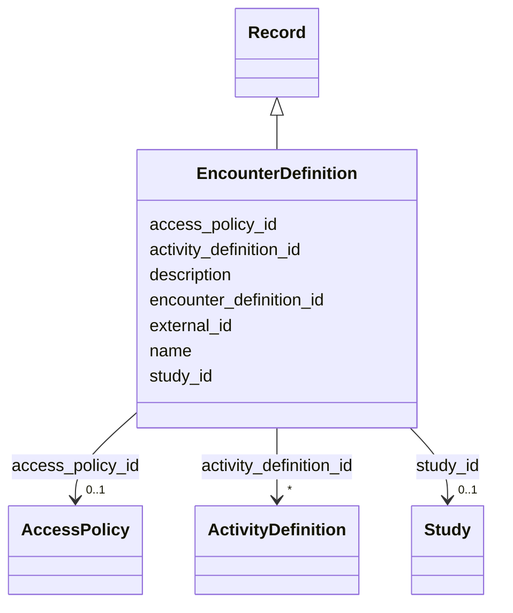

---
search:
  boost: 10.0
---

# Class: Encounter Definition (EncounterDefinition) 


_A definition of an encounter type in this study, ie, an event at which data was collected about a participant, an intervention was made, or information about a participant was recorded. This may be something planned by a study or a type of data collection._


<div data-search-exclude markdown="1">


URI: [acr_harmonized_data_model:EncounterDefinition](https://w3id.org/anvilproject/acr-harmonized-data-model/EncounterDefinition)





## Inheritance
* **EncounterDefinition** [ [Record](Record.md)]


## Slots

| Name | Cardinality and Range | Description | Inheritance |
| ---  | --- | --- | --- |
| [encounter_definition_id](encounter_definition_id.md) | 1 <br/> [PdGlobalID](PdGlobalID.md) | Unique identifier for this Encounter Definition | direct |
| [name](name.md) | 0..1 <br/> [String](String.md) | Name of the entity | direct |
| [description](description.md) | 0..1 <br/> [String](String.md) | Description for this entity | direct |
| [activity_definition_id](activity_definition_id.md) | * <br/> [ActivityDefinition](ActivityDefinition.md) | Unique identifier for this Activity Definition | direct |
| [external_id](external_id.md) | * <br/> [Uriorcurie](Uriorcurie.md) | Other identifiers for this entity, eg, from the submitting study or in system... | [Record](Record.md) |
| [access_policy_id](access_policy_id.md) | 0..1 <br/> [AccessPolicy](AccessPolicy.md) | Global identifier for the access policy that applies to this row of data | [Record](Record.md) |
| [study_id](study_id.md) | 0..1 <br/> [Study](Study.md) | INCLUDE Global ID for the study | [Record](Record.md) |


## Usages

| used by | used in | type | used |
| ---  | --- | --- | --- |
| [Encounter](Encounter.md) | [encounter_definition_id](encounter_definition_id.md) | range | [EncounterDefinition](EncounterDefinition.md) |


## Identifier and Mapping Information


### Schema Source


* from schema: https://w3id.org/anvilproject/acr-harmonized-data-model


## Mappings

| Mapping Type | Mapped Value |
| ---  | ---  |
| self | acr_harmonized_data_model:EncounterDefinition |
| native | acr_harmonized_data_model:EncounterDefinition |


## LinkML Source

<!-- TODO: investigate https://stackoverflow.com/questions/37606292/how-to-create-tabbed-code-blocks-in-mkdocs-or-sphinx -->

### Direct

<details>
```yaml
name: EncounterDefinition
description: A definition of an encounter type in this study, ie, an event at which
  data was collected about a participant, an intervention was made, or information
  about a participant was recorded. This may be something planned by a study or a
  type of data collection.
title: Encounter Definition
from_schema: https://w3id.org/anvilproject/acr-harmonized-data-model
mixins:
- Record
slots:
- encounter_definition_id
- name
- description
- activity_definition_id
slot_usage:
  encounter_definition_id:
    name: encounter_definition_id
    identifier: true
    range: pdGlobalID
    required: true
  activity_definition_id:
    name: activity_definition_id
    multivalued: true

```
</details>

### Induced

<details>
```yaml
name: EncounterDefinition
description: A definition of an encounter type in this study, ie, an event at which
  data was collected about a participant, an intervention was made, or information
  about a participant was recorded. This may be something planned by a study or a
  type of data collection.
title: Encounter Definition
from_schema: https://w3id.org/anvilproject/acr-harmonized-data-model
mixins:
- Record
slot_usage:
  encounter_definition_id:
    name: encounter_definition_id
    identifier: true
    range: pdGlobalID
    required: true
  activity_definition_id:
    name: activity_definition_id
    multivalued: true
attributes:
  encounter_definition_id:
    name: encounter_definition_id
    description: Unique identifier for this Encounter Definition.
    title: Encounter Definition ID
    from_schema: https://w3id.org/anvilproject/acr-harmonized-data-model
    rank: 1000
    identifier: true
    owner: EncounterDefinition
    domain_of:
    - Encounter
    - EncounterDefinition
    range: pdGlobalID
    required: true
  name:
    name: name
    description: Name of the entity.
    title: Name
    from_schema: https://w3id.org/anvilproject/acr-harmonized-data-model
    rank: 1000
    owner: EncounterDefinition
    domain_of:
    - VirtualBiorepository
    - Investigator
    - EncounterDefinition
    - ActivityDefinition
    - Dataset
    range: string
    required: false
  description:
    name: description
    description: Description for this entity.
    title: Description
    from_schema: https://w3id.org/anvilproject/acr-harmonized-data-model
    rank: 1000
    owner: EncounterDefinition
    domain_of:
    - EncounterDefinition
    - ActivityDefinition
    - Dataset
    range: string
  activity_definition_id:
    name: activity_definition_id
    description: Unique identifier for this Activity Definition.
    title: Activity Definition ID
    from_schema: https://w3id.org/anvilproject/acr-harmonized-data-model
    rank: 1000
    owner: EncounterDefinition
    domain_of:
    - EncounterDefinition
    - ActivityDefinition
    - Assay
    range: ActivityDefinition
    multivalued: true
  external_id:
    name: external_id
    description: Other identifiers for this entity, eg, from the submitting study
      or in systems like dbGaP
    title: External Identifiers
    from_schema: https://w3id.org/anvilproject/acr-harmonized-data-model
    rank: 1000
    owner: EncounterDefinition
    domain_of:
    - Record
    range: uriorcurie
    required: false
    multivalued: true
  access_policy_id:
    name: access_policy_id
    description: Global identifier for the access policy that applies to this row
      of data.
    title: Access Policy ID
    from_schema: https://w3id.org/anvilproject/acr-harmonized-data-model
    rank: 1000
    owner: EncounterDefinition
    domain_of:
    - Record
    - AccessPolicy
    range: AccessPolicy
  study_id:
    name: study_id
    description: INCLUDE Global ID for the study
    title: Study ID
    from_schema: https://w3id.org/anvilproject/acr-harmonized-data-model
    rank: 1000
    owner: EncounterDefinition
    domain_of:
    - Record
    - StudyMetadata
    range: Study
    multivalued: false

```
</details></div>