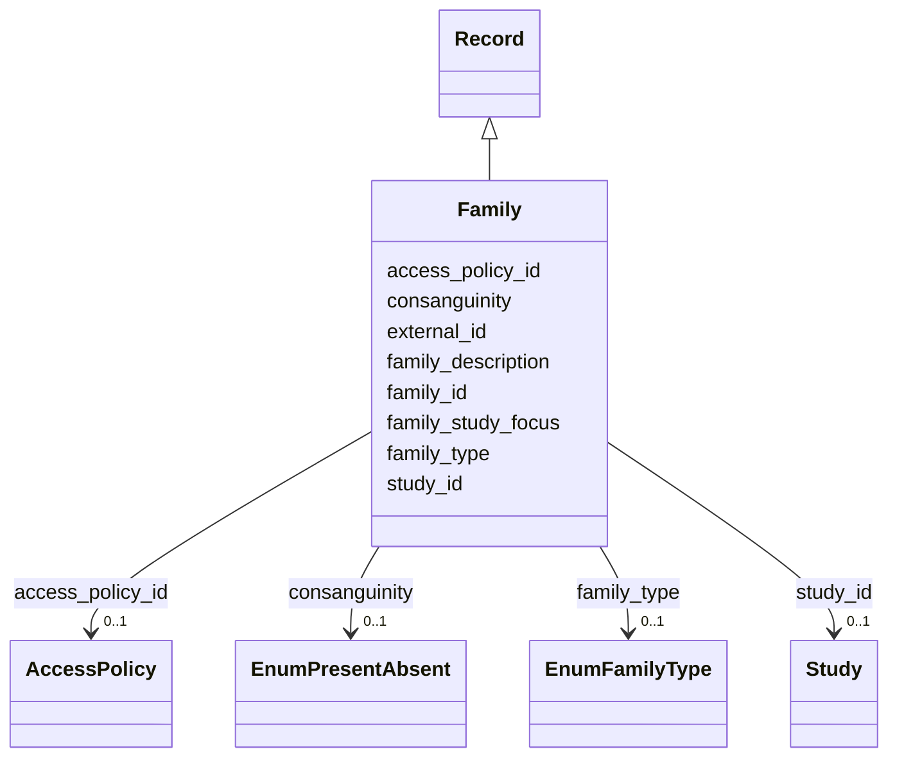

---
search:
  boost: 10.0
---

# Class: Family (Family) 


_A group of individuals of some relation who are grouped together in a study._


<div data-search-exclude markdown="1">


URI: [acr_harmonized_data_model:Family](https://w3id.org/anvilproject/acr-harmonized-data-model/Family)





## Inheritance
* **Family** [ [Record](Record.md)]


## Slots

| Name | Cardinality and Range | Description | Inheritance |
| ---  | --- | --- | --- |
| [family_id](family_id.md) | 1 <br/> [GrGlobalID](GrGlobalID.md) | Global ID for the Family | direct |
| [family_type](family_type.md) | 0..1 <br/> [EnumFamilyType](EnumFamilyType.md) | Describes the 'type' of study family, eg, trio | direct |
| [family_description](family_description.md) | 0..1 <br/> [String](String.md) | Free text describing the study family, such as potential inheritance or detai... | direct |
| [consanguinity](consanguinity.md) | 0..1 <br/> [EnumPresentAbsent](EnumPresentAbsent.md) | Is there known or suspected consanguinity in this study family? | direct |
| [family_study_focus](family_study_focus.md) | 0..1 <br/> [Uriorcurie](Uriorcurie.md) | The specific focus of the investigation, eg, a condition | direct |
| [external_id](external_id.md) | * <br/> [Uriorcurie](Uriorcurie.md) | Other identifiers for this entity, eg, from the submitting study or in system... | [Record](Record.md) |
| [access_policy_id](access_policy_id.md) | 0..1 <br/> [AccessPolicy](AccessPolicy.md) | Global identifier for the access policy that applies to this row of data | [Record](Record.md) |
| [study_id](study_id.md) | 0..1 <br/> [Study](Study.md) | INCLUDE Global ID for the study | [Record](Record.md) |


## Usages

| used by | used in | type | used |
| ---  | --- | --- | --- |
| [FamilyMembership](FamilyMembership.md) | [family_id](family_id.md) | range | [Family](Family.md) |


## Identifier and Mapping Information


### Schema Source


* from schema: https://w3id.org/anvilproject/acr-harmonized-data-model


## Mappings

| Mapping Type | Mapped Value |
| ---  | ---  |
| self | acr_harmonized_data_model:Family |
| native | acr_harmonized_data_model:Family |


## LinkML Source

<!-- TODO: investigate https://stackoverflow.com/questions/37606292/how-to-create-tabbed-code-blocks-in-mkdocs-or-sphinx -->

### Direct

<details>
```yaml
name: Family
description: A group of individuals of some relation who are grouped together in a
  study.
title: Family
from_schema: https://w3id.org/anvilproject/acr-harmonized-data-model
mixins:
- Record
slots:
- family_id
- family_type
- family_description
- consanguinity
- family_study_focus
slot_usage:
  family_id:
    name: family_id
    identifier: true
    range: grGlobalID
    required: true

```
</details>

### Induced

<details>
```yaml
name: Family
description: A group of individuals of some relation who are grouped together in a
  study.
title: Family
from_schema: https://w3id.org/anvilproject/acr-harmonized-data-model
mixins:
- Record
slot_usage:
  family_id:
    name: family_id
    identifier: true
    range: grGlobalID
    required: true
attributes:
  family_id:
    name: family_id
    description: Global ID for the Family
    title: Family ID
    from_schema: https://w3id.org/anvilproject/acr-harmonized-data-model
    rank: 1000
    identifier: true
    owner: Family
    domain_of:
    - Family
    - FamilyMembership
    range: grGlobalID
    required: true
  family_type:
    name: family_type
    description: Describes the 'type' of study family, eg, trio.
    from_schema: https://w3id.org/anvilproject/acr-harmonized-data-model
    rank: 1000
    owner: Family
    domain_of:
    - Family
    range: EnumFamilyType
  family_description:
    name: family_description
    description: Free text describing the study family, such as potential inheritance
      or details about consanguinity
    from_schema: https://w3id.org/anvilproject/acr-harmonized-data-model
    rank: 1000
    owner: Family
    domain_of:
    - Family
    range: string
  consanguinity:
    name: consanguinity
    description: Is there known or suspected consanguinity in this study family?
    from_schema: https://w3id.org/anvilproject/acr-harmonized-data-model
    rank: 1000
    owner: Family
    domain_of:
    - Family
    range: EnumPresentAbsent
  family_study_focus:
    name: family_study_focus
    description: The specific focus of the investigation, eg, a condition.
    from_schema: https://w3id.org/anvilproject/acr-harmonized-data-model
    rank: 1000
    owner: Family
    domain_of:
    - Family
    range: uriorcurie
  external_id:
    name: external_id
    description: Other identifiers for this entity, eg, from the submitting study
      or in systems like dbGaP
    title: External Identifiers
    from_schema: https://w3id.org/anvilproject/acr-harmonized-data-model
    rank: 1000
    owner: Family
    domain_of:
    - Record
    range: uriorcurie
    required: false
    multivalued: true
  access_policy_id:
    name: access_policy_id
    description: Global identifier for the access policy that applies to this row
      of data.
    title: Access Policy ID
    from_schema: https://w3id.org/anvilproject/acr-harmonized-data-model
    rank: 1000
    owner: Family
    domain_of:
    - Record
    - AccessPolicy
    range: AccessPolicy
  study_id:
    name: study_id
    description: INCLUDE Global ID for the study
    title: Study ID
    from_schema: https://w3id.org/anvilproject/acr-harmonized-data-model
    rank: 1000
    owner: Family
    domain_of:
    - Record
    - StudyMetadata
    range: Study
    multivalued: false

```
</details></div>