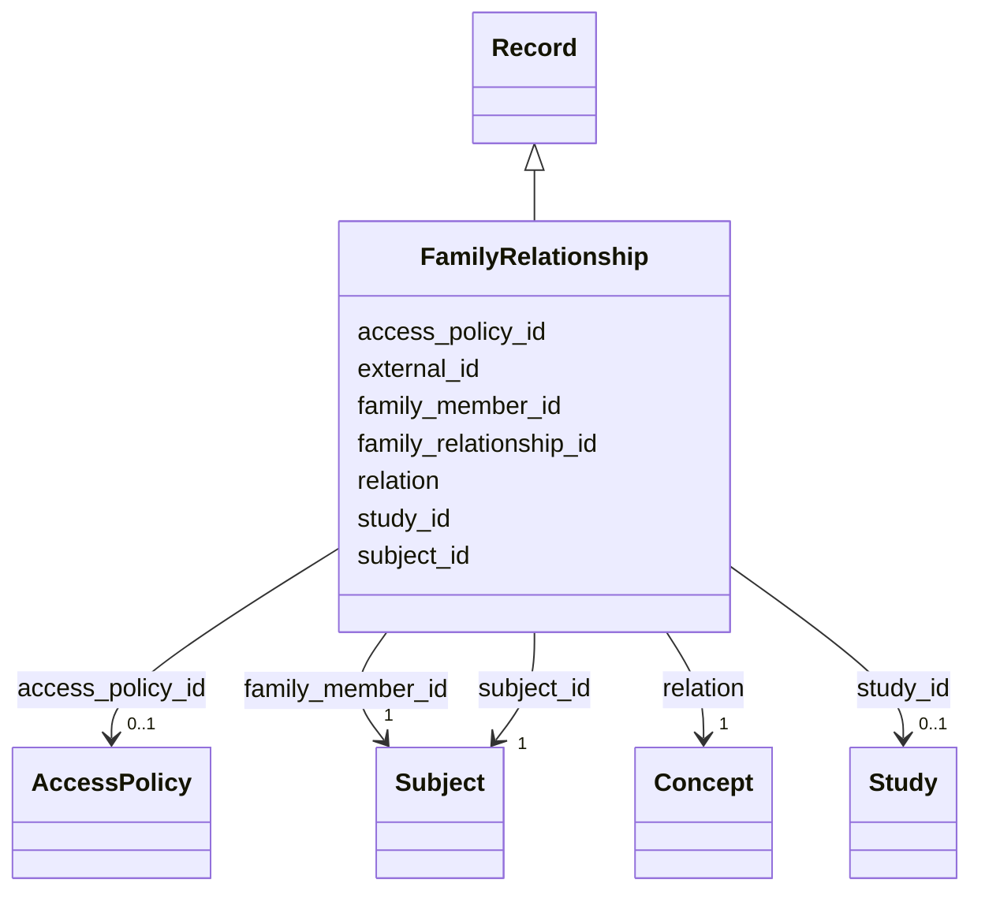

---
search:
  boost: 10.0
---

# Class: Family Member Relationship (FamilyRelationship) 


_A relationship between two Subjects. Directed as follows <family_member_id> <relationship> <subject_id> <Mother's id> <KIN:027 "isBiologicalMotherOf"> <subject_id>_


<div data-search-exclude markdown="1">


URI: [acr_harmonized_data_model:FamilyRelationship](https://w3id.org/anvilproject/acr-harmonized-data-model/FamilyRelationship)





## Inheritance
* **FamilyRelationship** [ [Record](Record.md)]


## Slots

| Name | Cardinality and Range | Description | Inheritance |
| ---  | --- | --- | --- |
| [family_relationship_id](family_relationship_id.md) | 1 <br/> [FmGlobalID](FmGlobalID.md) | Global ID for the Family Relationship | direct |
| [family_member_id](family_member_id.md) | 1 <br/> [Subject](Subject.md) | The family member Subject who is the relationship "subject" | direct |
| [relation](relation.md) | 1 <br/> [EnumFamilyRelation](EnumFamilyRelation.md)&nbsp;or&nbsp;<br />[EnumUnknown](EnumUnknown.md) | Code definting the relationship predicate | direct |
| [subject_id](subject_id.md) | 1 <br/> [Subject](Subject.md) | The family member Subject who is the relationship "object" | direct |
| [external_id](external_id.md) | * <br/> [Uriorcurie](Uriorcurie.md) | Other identifiers for this entity, eg, from the submitting study or in system... | [Record](Record.md) |
| [access_policy_id](access_policy_id.md) | 0..1 <br/> [AccessPolicy](AccessPolicy.md) | Global identifier for the access policy that applies to this row of data | [Record](Record.md) |
| [study_id](study_id.md) | 0..1 <br/> [Study](Study.md) | INCLUDE Global ID for the study | [Record](Record.md) |


## Identifier and Mapping Information


### Schema Source


* from schema: https://w3id.org/anvilproject/acr-harmonized-data-model


## Mappings

| Mapping Type | Mapped Value |
| ---  | ---  |
| self | acr_harmonized_data_model:FamilyRelationship |
| native | acr_harmonized_data_model:FamilyRelationship |


## LinkML Source

<!-- TODO: investigate https://stackoverflow.com/questions/37606292/how-to-create-tabbed-code-blocks-in-mkdocs-or-sphinx -->

### Direct

<details>
```yaml
name: FamilyRelationship
description: A relationship between two Subjects. Directed as follows <family_member_id>
  <relationship> <subject_id> <Mother's id> <KIN:027 "isBiologicalMotherOf"> <subject_id>
title: Family Member Relationship
from_schema: https://w3id.org/anvilproject/acr-harmonized-data-model
mixins:
- Record
slots:
- family_relationship_id
- family_member_id
- relation
- subject_id
slot_usage:
  family_relationship_id:
    name: family_relationship_id
    identifier: true
    range: fmGlobalID
    required: true
  subject_id:
    name: subject_id
    description: The family member Subject who is the relationship "object".
    required: true

```
</details>

### Induced

<details>
```yaml
name: FamilyRelationship
description: A relationship between two Subjects. Directed as follows <family_member_id>
  <relationship> <subject_id> <Mother's id> <KIN:027 "isBiologicalMotherOf"> <subject_id>
title: Family Member Relationship
from_schema: https://w3id.org/anvilproject/acr-harmonized-data-model
mixins:
- Record
slot_usage:
  family_relationship_id:
    name: family_relationship_id
    identifier: true
    range: fmGlobalID
    required: true
  subject_id:
    name: subject_id
    description: The family member Subject who is the relationship "object".
    required: true
attributes:
  family_relationship_id:
    name: family_relationship_id
    description: Global ID for the Family Relationship
    title: Family Relationship ID
    from_schema: https://w3id.org/anvilproject/acr-harmonized-data-model
    rank: 1000
    identifier: true
    owner: FamilyRelationship
    domain_of:
    - FamilyRelationship
    range: fmGlobalID
    required: true
  family_member_id:
    name: family_member_id
    description: The family member Subject who is the relationship "subject".
    from_schema: https://w3id.org/anvilproject/acr-harmonized-data-model
    rank: 1000
    owner: FamilyRelationship
    domain_of:
    - FamilyRelationship
    range: Subject
    required: true
    inlined: false
  relation:
    name: relation
    description: Code definting the relationship predicate. Relationship of the "Family
      Member" to the "Subject", eg, mother of. Ideally uses KIN ontology.
    from_schema: https://w3id.org/anvilproject/acr-harmonized-data-model
    rank: 1000
    owner: FamilyRelationship
    domain_of:
    - FamilyRelationship
    range: Concept
    required: true
    any_of:
    - range: EnumFamilyRelation
    - range: EnumUnknown
  subject_id:
    name: subject_id
    description: The family member Subject who is the relationship "object".
    title: Study ID
    from_schema: https://w3id.org/anvilproject/acr-harmonized-data-model
    rank: 1000
    owner: FamilyRelationship
    domain_of:
    - Subject
    - Demographics
    - FamilyRelationship
    - FamilyMembership
    - SubjectAssertion
    - Encounter
    - File
    - Assay
    range: Subject
    required: true
    multivalued: false
  external_id:
    name: external_id
    description: Other identifiers for this entity, eg, from the submitting study
      or in systems like dbGaP
    title: External Identifiers
    from_schema: https://w3id.org/anvilproject/acr-harmonized-data-model
    rank: 1000
    owner: FamilyRelationship
    domain_of:
    - Record
    range: uriorcurie
    required: false
    multivalued: true
  access_policy_id:
    name: access_policy_id
    description: Global identifier for the access policy that applies to this row
      of data.
    title: Access Policy ID
    from_schema: https://w3id.org/anvilproject/acr-harmonized-data-model
    rank: 1000
    owner: FamilyRelationship
    domain_of:
    - Record
    - AccessPolicy
    range: AccessPolicy
  study_id:
    name: study_id
    description: INCLUDE Global ID for the study
    title: Study ID
    from_schema: https://w3id.org/anvilproject/acr-harmonized-data-model
    rank: 1000
    owner: FamilyRelationship
    domain_of:
    - Record
    - StudyMetadata
    range: Study
    multivalued: false

```
</details></div>