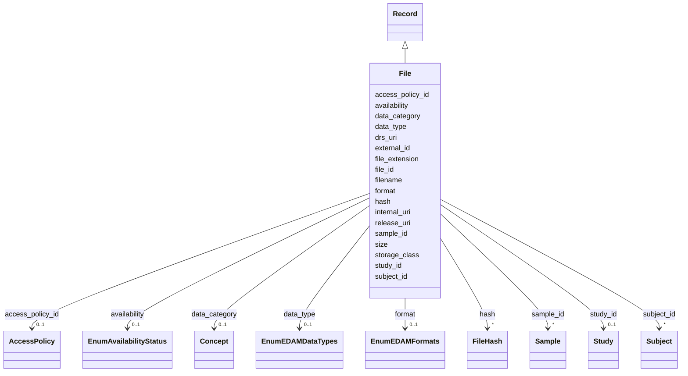

---
search:
  boost: 10.0
---

# Class: File (File) 


_File_


<div data-search-exclude markdown="1">


URI: [acr_harmonized_data_model:File](https://w3id.org/anvilproject/acr-harmonized-data-model/File)





## Inheritance
* **File** [ [Record](Record.md)]


## Slots

| Name | Cardinality and Range | Description | Inheritance |
| ---  | --- | --- | --- |
| [file_id](file_id.md) | 1 <br/> [DrGlobalID](DrGlobalID.md) | Unique identifier for this File | direct |
| [subject_id](subject_id.md) | * <br/> [Subject](Subject.md) | INCLUDE Global ID for the Subject | direct |
| [sample_id](sample_id.md) | * <br/> [Sample](Sample.md) | The unique identifier for this Sample | direct |
| [filename](filename.md) | 0..1 <br/> [String](String.md) | The name of the file | direct |
| [format](format.md) | 0..1 <br/> [EnumEDAMFormats](EnumEDAMFormats.md) | The format of the file | direct |
| [file_extension](file_extension.md) | 1 <br/> [String](String.md) | Typically a 3-4 letter code at the end of a filename that identifies the file... | direct |
| [data_category](data_category.md) | 0..1 <br/> [Concept](Concept.md)&nbsp;or&nbsp;<br />[EnumDataCategory](EnumDataCategory.md) | General category of data in this Record (e | direct |
| [data_type](data_type.md) | 0..1 <br/> [EnumEDAMDataTypes](EnumEDAMDataTypes.md) | The type of data within this file | direct |
| [format](format.md) | 0..1 <br/> [EnumEDAMFormats](EnumEDAMFormats.md) | The format of the file | direct |
| [size](size.md) | 0..1 <br/> [Integer](Integer.md) | Size of the file, in Bytes | direct |
| [internal_uri](internal_uri.md) | 0..1 <br/> [Uriorcurie](Uriorcurie.md) | URI/URL for internal access to the data | direct |
| [release_uri](release_uri.md) | 0..1 <br/> [Uriorcurie](Uriorcurie.md) | URI/URL for controlled or open access to the data | direct |
| [drs_uri](drs_uri.md) | 0..1 <br/> [Uriorcurie](Uriorcurie.md) | DRS location to access the data | direct |
| [storage_class](storage_class.md) | 0..1 <br/> [String](String.md) | Storage class of the object, reflecting cost and access characteristics | direct |
| [hash](hash.md) | * <br/> [FileHash](FileHash.md) | File hash information | direct |
| [availability](availability.md) | 0..1 <br/> [EnumAvailabilityStatus](EnumAvailabilityStatus.md) | Is or was this file available to users? | direct |
| [external_id](external_id.md) | * <br/> [Uriorcurie](Uriorcurie.md) | Other identifiers for this entity, eg, from the submitting study or in system... | [Record](Record.md) |
| [access_policy_id](access_policy_id.md) | 0..1 <br/> [AccessPolicy](AccessPolicy.md) | Global identifier for the access policy that applies to this row of data | [Record](Record.md) |
| [study_id](study_id.md) | 0..1 <br/> [Study](Study.md) | INCLUDE Global ID for the study | [Record](Record.md) |


## Usages

| used by | used in | type | used |
| ---  | --- | --- | --- |
| [Assay](Assay.md) | [file_id](file_id.md) | range | [File](File.md) |
| [Dataset](Dataset.md) | [file_id](file_id.md) | range | [File](File.md) |


## Identifier and Mapping Information


### Schema Source


* from schema: https://w3id.org/anvilproject/acr-harmonized-data-model


## Mappings

| Mapping Type | Mapped Value |
| ---  | ---  |
| self | acr_harmonized_data_model:File |
| native | acr_harmonized_data_model:File |


## LinkML Source

<!-- TODO: investigate https://stackoverflow.com/questions/37606292/how-to-create-tabbed-code-blocks-in-mkdocs-or-sphinx -->

### Direct

<details>
```yaml
name: File
description: File
title: File
from_schema: https://w3id.org/anvilproject/acr-harmonized-data-model
mixins:
- Record
slots:
- file_id
- subject_id
- sample_id
- filename
- format
- file_extension
- data_category
- data_type
- format
- size
- internal_uri
- release_uri
- drs_uri
- storage_class
- hash
- availability
slot_usage:
  file_id:
    name: file_id
    identifier: true
    range: drGlobalID
    required: true
  subject_id:
    name: subject_id
    multivalued: true
  sample_id:
    name: sample_id
    multivalued: true

```
</details>

### Induced

<details>
```yaml
name: File
description: File
title: File
from_schema: https://w3id.org/anvilproject/acr-harmonized-data-model
mixins:
- Record
slot_usage:
  file_id:
    name: file_id
    identifier: true
    range: drGlobalID
    required: true
  subject_id:
    name: subject_id
    multivalued: true
  sample_id:
    name: sample_id
    multivalued: true
attributes:
  file_id:
    name: file_id
    description: Unique identifier for this File.
    title: File ID
    from_schema: https://w3id.org/anvilproject/acr-harmonized-data-model
    rank: 1000
    identifier: true
    owner: File
    domain_of:
    - File
    - Assay
    - Dataset
    range: drGlobalID
    required: true
  subject_id:
    name: subject_id
    description: INCLUDE Global ID for the Subject
    title: Study ID
    from_schema: https://w3id.org/anvilproject/acr-harmonized-data-model
    rank: 1000
    owner: File
    domain_of:
    - Subject
    - Demographics
    - FamilyRelationship
    - FamilyMembership
    - SubjectAssertion
    - Encounter
    - File
    - Assay
    range: Subject
    multivalued: true
  sample_id:
    name: sample_id
    description: The unique identifier for this Sample.
    title: Sample ID
    from_schema: https://w3id.org/anvilproject/acr-harmonized-data-model
    rank: 1000
    owner: File
    domain_of:
    - Sample
    - Aliquot
    - File
    - Assay
    range: Sample
    multivalued: true
  filename:
    name: filename
    description: The name of the file.
    title: Filename
    from_schema: https://w3id.org/anvilproject/acr-harmonized-data-model
    rank: 1000
    owner: File
    domain_of:
    - File
    range: string
  format:
    name: format
    description: The format of the file.
    title: File Format
    from_schema: https://w3id.org/anvilproject/acr-harmonized-data-model
    rank: 1000
    owner: File
    domain_of:
    - File
    range: EnumEDAMFormats
  file_extension:
    name: file_extension
    description: Typically a 3-4 letter code at the end of a filename that identifies
      the file format. Empty string for no extension.
    title: File Extension
    from_schema: https://w3id.org/anvilproject/acr-harmonized-data-model
    rank: 1000
    owner: File
    domain_of:
    - File
    range: string
    required: true
  data_category:
    name: data_category
    description: General category of data in this Record (e.g. Clinical, Genomics,
      etc)
    title: Data Category
    from_schema: https://w3id.org/anvilproject/acr-harmonized-data-model
    rank: 1000
    owner: File
    domain_of:
    - StudyMetadata
    - File
    range: Concept
    any_of:
    - range: Concept
    - range: EnumDataCategory
  data_type:
    name: data_type
    description: The type of data within this file.
    title: Data Type
    from_schema: https://w3id.org/anvilproject/acr-harmonized-data-model
    rank: 1000
    owner: File
    domain_of:
    - File
    range: EnumEDAMDataTypes
  size:
    name: size
    description: Size of the file, in Bytes. May require BigInt or similar.
    title: File Size
    from_schema: https://w3id.org/anvilproject/acr-harmonized-data-model
    rank: 1000
    owner: File
    domain_of:
    - File
    range: integer
    unit:
      ucum_code: By
  internal_uri:
    name: internal_uri
    description: URI/URL for internal access to the data. May be temporary.
    title: Internal Staging Location
    from_schema: https://w3id.org/anvilproject/acr-harmonized-data-model
    rank: 1000
    owner: File
    domain_of:
    - File
    range: uriorcurie
  release_uri:
    name: release_uri
    description: URI/URL for controlled or open access to the data.
    title: Release Location
    from_schema: https://w3id.org/anvilproject/acr-harmonized-data-model
    rank: 1000
    owner: File
    domain_of:
    - File
    range: uriorcurie
  drs_uri:
    name: drs_uri
    description: DRS location to access the data.
    title: DRS URI
    from_schema: https://w3id.org/anvilproject/acr-harmonized-data-model
    rank: 1000
    owner: File
    domain_of:
    - File
    range: uriorcurie
  storage_class:
    name: storage_class
    description: Storage class of the object, reflecting cost and access characteristics.
    title: Storage Class
    from_schema: https://w3id.org/anvilproject/acr-harmonized-data-model
    rank: 1000
    owner: File
    domain_of:
    - File
    range: string
  hash:
    name: hash
    description: File hash information
    title: File Hash
    from_schema: https://w3id.org/anvilproject/acr-harmonized-data-model
    rank: 1000
    owner: File
    domain_of:
    - File
    range: FileHash
    multivalued: true
  availability:
    name: availability
    description: Is or was this file available to users?
    title: File Availability
    from_schema: https://w3id.org/anvilproject/acr-harmonized-data-model
    rank: 1000
    owner: File
    domain_of:
    - File
    range: EnumAvailabilityStatus
  external_id:
    name: external_id
    description: Other identifiers for this entity, eg, from the submitting study
      or in systems like dbGaP
    title: External Identifiers
    from_schema: https://w3id.org/anvilproject/acr-harmonized-data-model
    rank: 1000
    owner: File
    domain_of:
    - Record
    range: uriorcurie
    required: false
    multivalued: true
  access_policy_id:
    name: access_policy_id
    description: Global identifier for the access policy that applies to this row
      of data.
    title: Access Policy ID
    from_schema: https://w3id.org/anvilproject/acr-harmonized-data-model
    rank: 1000
    owner: File
    domain_of:
    - Record
    - AccessPolicy
    range: AccessPolicy
  study_id:
    name: study_id
    description: INCLUDE Global ID for the study
    title: Study ID
    from_schema: https://w3id.org/anvilproject/acr-harmonized-data-model
    rank: 1000
    owner: File
    domain_of:
    - Record
    - StudyMetadata
    range: Study
    multivalued: false

```
</details></div>