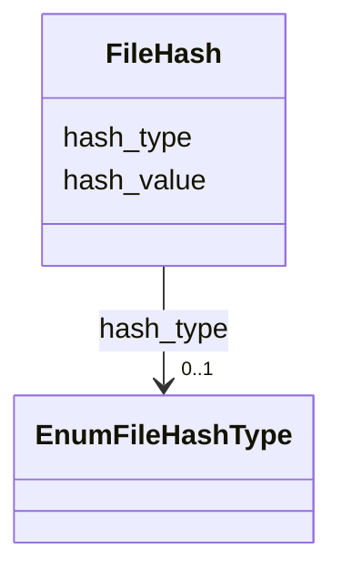

---
search:
  boost: 10.0
---

# Class: File Hash (FileHash) 


_Type and value of a file content hash._


<div data-search-exclude markdown="1">


URI: [acr_harmonized_data_model:FileHash](https://w3id.org/anvilproject/acr-harmonized-data-model/FileHash)





<!-- no inheritance hierarchy -->

## Slots

| Name | Cardinality and Range | Description | Inheritance |
| ---  | --- | --- | --- |
| [hash_type](hash_type.md) | 0..1 <br/> [EnumFileHashType](EnumFileHashType.md) | The type of file hash, eg, md5 | direct |
| [hash_value](hash_value.md) | 0..1 <br/> [String](String.md) | The value of the file hash | direct |


## Usages

| used by | used in | type | used |
| ---  | --- | --- | --- |
| [File](File.md) | [hash](hash.md) | range | [FileHash](FileHash.md) |


## Identifier and Mapping Information


### Schema Source


* from schema: https://w3id.org/anvilproject/acr-harmonized-data-model


## Mappings

| Mapping Type | Mapped Value |
| ---  | ---  |
| self | acr_harmonized_data_model:FileHash |
| native | acr_harmonized_data_model:FileHash |


## LinkML Source

<!-- TODO: investigate https://stackoverflow.com/questions/37606292/how-to-create-tabbed-code-blocks-in-mkdocs-or-sphinx -->

### Direct

<details>
```yaml
name: FileHash
description: Type and value of a file content hash.
title: File Hash
from_schema: https://w3id.org/anvilproject/acr-harmonized-data-model
slots:
- hash_type
- hash_value

```
</details>

### Induced

<details>
```yaml
name: FileHash
description: Type and value of a file content hash.
title: File Hash
from_schema: https://w3id.org/anvilproject/acr-harmonized-data-model
attributes:
  hash_type:
    name: hash_type
    description: The type of file hash, eg, md5
    title: File Hash Type
    from_schema: https://w3id.org/anvilproject/acr-harmonized-data-model
    rank: 1000
    owner: FileHash
    domain_of:
    - FileHash
    range: EnumFileHashType
  hash_value:
    name: hash_value
    description: The value of the file hash
    title: File Hash Value
    from_schema: https://w3id.org/anvilproject/acr-harmonized-data-model
    rank: 1000
    owner: FileHash
    domain_of:
    - FileHash
    range: string

```
</details></div>