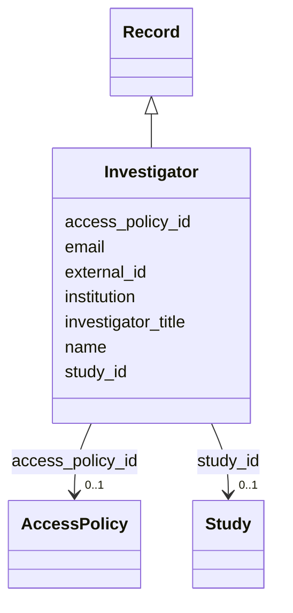

---
search:
  boost: 10.0
---

# Class: Investigator (Investigator) 


_An individual who made contributions to the collection, analysis, or sharing of data._


<div data-search-exclude markdown="1">


URI: [acr_harmonized_data_model:Investigator](https://w3id.org/anvilproject/acr-harmonized-data-model/Investigator)





## Inheritance
* **Investigator** [ [Record](Record.md)]


## Slots

| Name | Cardinality and Range | Description | Inheritance |
| ---  | --- | --- | --- |
| [name](name.md) | 0..1 <br/> [String](String.md) | Name of the entity | direct |
| [institution](institution.md) | 0..1 <br/> [String](String.md) | Name of the institution this record is associated with | direct |
| [investigator_title](investigator_title.md) | 0..1 <br/> [String](String.md) | The title of the Investigator, eg, "Assistant Professor" | direct |
| [email](email.md) | 0..1 <br/> [String](String.md) | An email address to reach the entity | direct |
| [external_id](external_id.md) | * <br/> [Uriorcurie](Uriorcurie.md) | Other identifiers for this entity, eg, from the submitting study or in system... | [Record](Record.md) |
| [access_policy_id](access_policy_id.md) | 0..1 <br/> [AccessPolicy](AccessPolicy.md) | Global identifier for the access policy that applies to this row of data | [Record](Record.md) |
| [study_id](study_id.md) | 0..1 <br/> [Study](Study.md) | INCLUDE Global ID for the study | [Record](Record.md) |


## Usages

| used by | used in | type | used |
| ---  | --- | --- | --- |
| [Study](Study.md) | [principal_investigator](principal_investigator.md) | range | [Investigator](Investigator.md) |
| [Study](Study.md) | [contact](contact.md) | range | [Investigator](Investigator.md) |
| [VirtualBiorepository](VirtualBiorepository.md) | [contact](contact.md) | range | [Investigator](Investigator.md) |


## Identifier and Mapping Information


### Schema Source


* from schema: https://w3id.org/anvilproject/acr-harmonized-data-model


## Mappings

| Mapping Type | Mapped Value |
| ---  | ---  |
| self | acr_harmonized_data_model:Investigator |
| native | acr_harmonized_data_model:Investigator |


## LinkML Source

<!-- TODO: investigate https://stackoverflow.com/questions/37606292/how-to-create-tabbed-code-blocks-in-mkdocs-or-sphinx -->

### Direct

<details>
```yaml
name: Investigator
description: An individual who made contributions to the collection, analysis, or
  sharing of data.
title: Investigator
from_schema: https://w3id.org/anvilproject/acr-harmonized-data-model
mixins:
- Record
slots:
- name
- institution
- investigator_title
- email

```
</details>

### Induced

<details>
```yaml
name: Investigator
description: An individual who made contributions to the collection, analysis, or
  sharing of data.
title: Investigator
from_schema: https://w3id.org/anvilproject/acr-harmonized-data-model
mixins:
- Record
attributes:
  name:
    name: name
    description: Name of the entity.
    title: Name
    from_schema: https://w3id.org/anvilproject/acr-harmonized-data-model
    rank: 1000
    owner: Investigator
    domain_of:
    - VirtualBiorepository
    - Investigator
    - EncounterDefinition
    - ActivityDefinition
    - Dataset
    range: string
    required: false
  institution:
    name: institution
    description: Name of the institution this record is associated with.
    title: Institution
    from_schema: https://w3id.org/anvilproject/acr-harmonized-data-model
    rank: 1000
    owner: Investigator
    domain_of:
    - VirtualBiorepository
    - Investigator
    range: string
    required: false
  investigator_title:
    name: investigator_title
    description: The title of the Investigator, eg, "Assistant Professor"
    title: Investigator Title
    from_schema: https://w3id.org/anvilproject/acr-harmonized-data-model
    rank: 1000
    owner: Investigator
    domain_of:
    - Investigator
    range: string
    required: false
  email:
    name: email
    description: An email address to reach the entity.
    title: Email Address
    from_schema: https://w3id.org/anvilproject/acr-harmonized-data-model
    rank: 1000
    owner: Investigator
    domain_of:
    - Investigator
    range: string
    required: false
  external_id:
    name: external_id
    description: Other identifiers for this entity, eg, from the submitting study
      or in systems like dbGaP
    title: External Identifiers
    from_schema: https://w3id.org/anvilproject/acr-harmonized-data-model
    rank: 1000
    owner: Investigator
    domain_of:
    - Record
    range: uriorcurie
    required: false
    multivalued: true
  access_policy_id:
    name: access_policy_id
    description: Global identifier for the access policy that applies to this row
      of data.
    title: Access Policy ID
    from_schema: https://w3id.org/anvilproject/acr-harmonized-data-model
    rank: 1000
    owner: Investigator
    domain_of:
    - Record
    - AccessPolicy
    range: AccessPolicy
  study_id:
    name: study_id
    description: INCLUDE Global ID for the study
    title: Study ID
    from_schema: https://w3id.org/anvilproject/acr-harmonized-data-model
    rank: 1000
    owner: Investigator
    domain_of:
    - Record
    - StudyMetadata
    range: Study
    multivalued: false

```
</details></div>