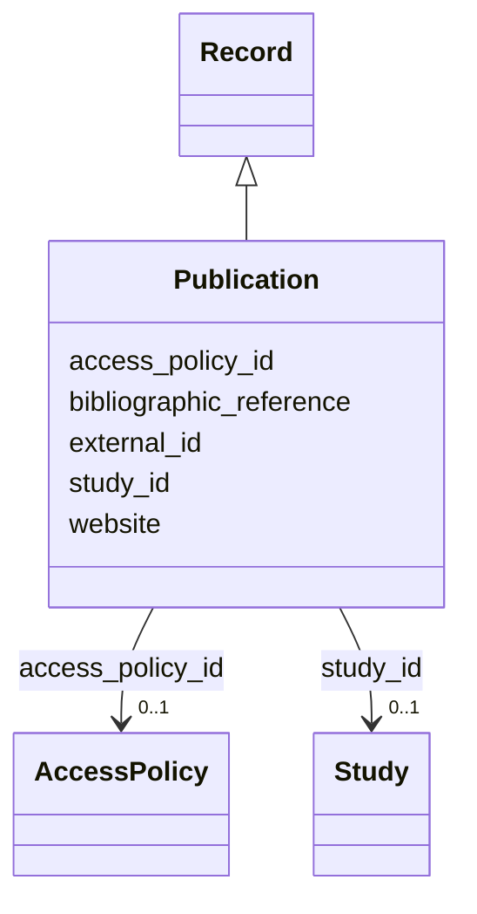

---
search:
  boost: 10.0
---

# Class: Publication (Publication) 


_Information about a specific publication._


<div data-search-exclude markdown="1">


URI: [acr_harmonized_data_model:Publication](https://w3id.org/anvilproject/acr-harmonized-data-model/Publication)





## Inheritance
* **Publication** [ [Record](Record.md)]


## Slots

| Name | Cardinality and Range | Description | Inheritance |
| ---  | --- | --- | --- |
| [bibliographic_reference](bibliographic_reference.md) | 0..1 <br/> [String](String.md) | Text use to reference this Record | direct |
| [website](website.md) | 0..1 <br/> [Uri](Uri.md) | Website with more information about this entity | direct |
| [external_id](external_id.md) | * <br/> [Uriorcurie](Uriorcurie.md) | Other identifiers for this entity, eg, from the submitting study or in system... | [Record](Record.md) |
| [access_policy_id](access_policy_id.md) | 0..1 <br/> [AccessPolicy](AccessPolicy.md) | Global identifier for the access policy that applies to this row of data | [Record](Record.md) |
| [study_id](study_id.md) | 0..1 <br/> [Study](Study.md) | INCLUDE Global ID for the study | [Record](Record.md) |


## Usages

| used by | used in | type | used |
| ---  | --- | --- | --- |
| [Study](Study.md) | [publication](publication.md) | range | [Publication](Publication.md) |
| [Dataset](Dataset.md) | [publication](publication.md) | range | [Publication](Publication.md) |


## Identifier and Mapping Information


### Schema Source


* from schema: https://w3id.org/anvilproject/acr-harmonized-data-model


## Mappings

| Mapping Type | Mapped Value |
| ---  | ---  |
| self | acr_harmonized_data_model:Publication |
| native | acr_harmonized_data_model:Publication |


## LinkML Source

<!-- TODO: investigate https://stackoverflow.com/questions/37606292/how-to-create-tabbed-code-blocks-in-mkdocs-or-sphinx -->

### Direct

<details>
```yaml
name: Publication
description: Information about a specific publication.
title: Publication
from_schema: https://w3id.org/anvilproject/acr-harmonized-data-model
mixins:
- Record
slots:
- bibliographic_reference
- website

```
</details>

### Induced

<details>
```yaml
name: Publication
description: Information about a specific publication.
title: Publication
from_schema: https://w3id.org/anvilproject/acr-harmonized-data-model
mixins:
- Record
attributes:
  bibliographic_reference:
    name: bibliographic_reference
    description: Text use to reference this Record.
    title: Bibiliographic Reference
    from_schema: https://w3id.org/anvilproject/acr-harmonized-data-model
    rank: 1000
    owner: Publication
    domain_of:
    - DOI
    - Publication
    range: string
  website:
    name: website
    description: Website with more information about this entity.
    title: Website
    from_schema: https://w3id.org/anvilproject/acr-harmonized-data-model
    rank: 1000
    owner: Publication
    domain_of:
    - AccessPolicy
    - Study
    - VirtualBiorepository
    - Publication
    range: uri
  external_id:
    name: external_id
    description: Other identifiers for this entity, eg, from the submitting study
      or in systems like dbGaP
    title: External Identifiers
    from_schema: https://w3id.org/anvilproject/acr-harmonized-data-model
    rank: 1000
    owner: Publication
    domain_of:
    - Record
    range: uriorcurie
    required: false
    multivalued: true
  access_policy_id:
    name: access_policy_id
    description: Global identifier for the access policy that applies to this row
      of data.
    title: Access Policy ID
    from_schema: https://w3id.org/anvilproject/acr-harmonized-data-model
    rank: 1000
    owner: Publication
    domain_of:
    - Record
    - AccessPolicy
    range: AccessPolicy
  study_id:
    name: study_id
    description: INCLUDE Global ID for the study
    title: Study ID
    from_schema: https://w3id.org/anvilproject/acr-harmonized-data-model
    rank: 1000
    owner: Publication
    domain_of:
    - Record
    - StudyMetadata
    range: Study
    multivalued: false

```
</details></div>