---
search:
  boost: 10.0
---

# Class: Record (Record) 


_One row / entity within the database_


<div data-search-exclude markdown="1">


* __NOTE__: this is an abstract class and should not be instantiated directly


URI: [acr_harmonized_data_model:Record](https://w3id.org/anvilproject/acr-harmonized-data-model/Record)

```mermaid
 classDiagram
    class Record
    click Record href "../Record/"
      Record <|-- Study
        click Study href "../Study/"
      Record <|-- StudyMetadata
        click StudyMetadata href "../StudyMetadata/"
      Record <|-- VirtualBiorepository
        click VirtualBiorepository href "../VirtualBiorepository/"
      Record <|-- DOI
        click DOI href "../DOI/"
      Record <|-- Investigator
        click Investigator href "../Investigator/"
      Record <|-- Publication
        click Publication href "../Publication/"
      Record <|-- Subject
        click Subject href "../Subject/"
      Record <|-- Demographics
        click Demographics href "../Demographics/"
      Record <|-- Family
        click Family href "../Family/"
      Record <|-- FamilyRelationship
        click FamilyRelationship href "../FamilyRelationship/"
      Record <|-- FamilyMembership
        click FamilyMembership href "../FamilyMembership/"
      Record <|-- SubjectAssertion
        click SubjectAssertion href "../SubjectAssertion/"
      Record <|-- Sample
        click Sample href "../Sample/"
      Record <|-- BiospecimenCollection
        click BiospecimenCollection href "../BiospecimenCollection/"
      Record <|-- Aliquot
        click Aliquot href "../Aliquot/"
      Record <|-- Encounter
        click Encounter href "../Encounter/"
      Record <|-- EncounterDefinition
        click EncounterDefinition href "../EncounterDefinition/"
      Record <|-- ActivityDefinition
        click ActivityDefinition href "../ActivityDefinition/"
      Record <|-- File
        click File href "../File/"
      Record <|-- Assay
        click Assay href "../Assay/"
      
      Record : access_policy_id
        
          
    
        
        
        Record --> "0..1" AccessPolicy : access_policy_id
        click AccessPolicy href "../AccessPolicy/"
    

        
      Record : external_id
        
      Record : study_id
        
          
    
        
        
        Record --> "0..1" Study : study_id
        click Study href "../Study/"
    

        
      
```





<!-- no inheritance hierarchy -->

## Slots

| Name | Cardinality and Range | Description | Inheritance |
| ---  | --- | --- | --- |
| [external_id](external_id.md) | * <br/> [Uriorcurie](Uriorcurie.md) | Other identifiers for this entity, eg, from the submitting study or in system... | direct |
| [access_policy_id](access_policy_id.md) | 0..1 <br/> [AccessPolicy](AccessPolicy.md) | Global identifier for the access policy that applies to this row of data | direct |
| [study_id](study_id.md) | 0..1 <br/> [Study](Study.md) | INCLUDE Global ID for the study | direct |


## Identifier and Mapping Information


### Schema Source


* from schema: https://w3id.org/anvilproject/acr-harmonized-data-model


## Mappings

| Mapping Type | Mapped Value |
| ---  | ---  |
| self | acr_harmonized_data_model:Record |
| native | acr_harmonized_data_model:Record |


## LinkML Source

<!-- TODO: investigate https://stackoverflow.com/questions/37606292/how-to-create-tabbed-code-blocks-in-mkdocs-or-sphinx -->

### Direct

<details>
```yaml
name: Record
description: One row / entity within the database
title: Record
from_schema: https://w3id.org/anvilproject/acr-harmonized-data-model
abstract: true
slots:
- external_id
- access_policy_id
- study_id

```
</details>

### Induced

<details>
```yaml
name: Record
description: One row / entity within the database
title: Record
from_schema: https://w3id.org/anvilproject/acr-harmonized-data-model
abstract: true
attributes:
  external_id:
    name: external_id
    description: Other identifiers for this entity, eg, from the submitting study
      or in systems like dbGaP
    title: External Identifiers
    from_schema: https://w3id.org/anvilproject/acr-harmonized-data-model
    rank: 1000
    owner: Record
    domain_of:
    - Record
    range: uriorcurie
    required: false
    multivalued: true
  access_policy_id:
    name: access_policy_id
    description: Global identifier for the access policy that applies to this row
      of data.
    title: Access Policy ID
    from_schema: https://w3id.org/anvilproject/acr-harmonized-data-model
    rank: 1000
    owner: Record
    domain_of:
    - Record
    - AccessPolicy
    range: AccessPolicy
  study_id:
    name: study_id
    description: INCLUDE Global ID for the study
    title: Study ID
    from_schema: https://w3id.org/anvilproject/acr-harmonized-data-model
    rank: 1000
    owner: Record
    domain_of:
    - Record
    - StudyMetadata
    range: Study
    multivalued: false

```
</details></div>