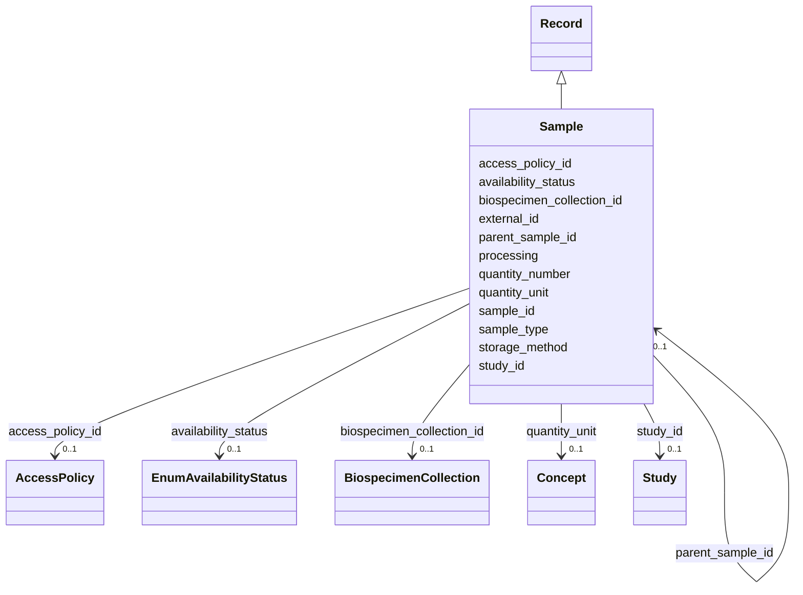

---
search:
  boost: 10.0
---

# Class: Sample (Sample) 


_A functionally equivalent specimen taken from a participant or processed from such a sample._


<div data-search-exclude markdown="1">


URI: [acr_harmonized_data_model:Sample](https://w3id.org/anvilproject/acr-harmonized-data-model/Sample)





## Inheritance
* **Sample** [ [Record](Record.md)]


## Slots

| Name | Cardinality and Range | Description | Inheritance |
| ---  | --- | --- | --- |
| [sample_id](sample_id.md) | 1 <br/> [BsGlobalID](BsGlobalID.md) | The unique identifier for this Sample | direct |
| [biospecimen_collection_id](biospecimen_collection_id.md) | 0..1 <br/> [BiospecimenCollection](BiospecimenCollection.md) | Biospecimen Collection during which this sample was generated | direct |
| [parent_sample_id](parent_sample_id.md) | 0..1 <br/> [Sample](Sample.md) | Sample from which this sample is derived | direct |
| [sample_type](sample_type.md) | 1 <br/> [Uriorcurie](Uriorcurie.md) | Type of material of which this Sample is comprised | direct |
| [processing](processing.md) | * <br/> [Uriorcurie](Uriorcurie.md) | Processing that was applied to the Parent Sample or from the Biospecimen Coll... | direct |
| [availability_status](availability_status.md) | 0..1 <br/> [EnumAvailabilityStatus](EnumAvailabilityStatus.md) | Can this Sample be requested for further analysis? | direct |
| [storage_method](storage_method.md) | * <br/> [Uriorcurie](Uriorcurie.md) | Sample storage method, eg, Frozen or with additives | direct |
| [quantity_number](quantity_number.md) | 0..1 <br/> [Float](Float.md) | The total quantity of the specimen | direct |
| [quantity_unit](quantity_unit.md) | 0..1 <br/> [Concept](Concept.md) | The structured term defining the units of the quantity | direct |
| [external_id](external_id.md) | * <br/> [Uriorcurie](Uriorcurie.md) | Other identifiers for this entity, eg, from the submitting study or in system... | [Record](Record.md) |
| [access_policy_id](access_policy_id.md) | 0..1 <br/> [AccessPolicy](AccessPolicy.md) | Global identifier for the access policy that applies to this row of data | [Record](Record.md) |
| [study_id](study_id.md) | 0..1 <br/> [Study](Study.md) | INCLUDE Global ID for the study | [Record](Record.md) |


## Usages

| used by | used in | type | used |
| ---  | --- | --- | --- |
| [Sample](Sample.md) | [parent_sample_id](parent_sample_id.md) | range | [Sample](Sample.md) |
| [Aliquot](Aliquot.md) | [sample_id](sample_id.md) | range | [Sample](Sample.md) |
| [File](File.md) | [sample_id](sample_id.md) | range | [Sample](Sample.md) |
| [Assay](Assay.md) | [sample_id](sample_id.md) | range | [Sample](Sample.md) |


## Identifier and Mapping Information


### Schema Source


* from schema: https://w3id.org/anvilproject/acr-harmonized-data-model


## Mappings

| Mapping Type | Mapped Value |
| ---  | ---  |
| self | acr_harmonized_data_model:Sample |
| native | acr_harmonized_data_model:Sample |


## LinkML Source

<!-- TODO: investigate https://stackoverflow.com/questions/37606292/how-to-create-tabbed-code-blocks-in-mkdocs-or-sphinx -->

### Direct

<details>
```yaml
name: Sample
description: A functionally equivalent specimen taken from a participant or processed
  from such a sample.
title: Sample
from_schema: https://w3id.org/anvilproject/acr-harmonized-data-model
mixins:
- Record
slots:
- sample_id
- biospecimen_collection_id
- parent_sample_id
- sample_type
- processing
- availability_status
- storage_method
- quantity_number
- quantity_unit
slot_usage:
  sample_id:
    name: sample_id
    identifier: true
    range: bsGlobalID
    required: true
  biospecimen_collection_id:
    name: biospecimen_collection_id
    description: Biospecimen Collection during which this sample was generated.

```
</details>

### Induced

<details>
```yaml
name: Sample
description: A functionally equivalent specimen taken from a participant or processed
  from such a sample.
title: Sample
from_schema: https://w3id.org/anvilproject/acr-harmonized-data-model
mixins:
- Record
slot_usage:
  sample_id:
    name: sample_id
    identifier: true
    range: bsGlobalID
    required: true
  biospecimen_collection_id:
    name: biospecimen_collection_id
    description: Biospecimen Collection during which this sample was generated.
attributes:
  sample_id:
    name: sample_id
    description: The unique identifier for this Sample.
    title: Sample ID
    from_schema: https://w3id.org/anvilproject/acr-harmonized-data-model
    rank: 1000
    identifier: true
    owner: Sample
    domain_of:
    - Sample
    - Aliquot
    - File
    - Assay
    range: bsGlobalID
    required: true
  biospecimen_collection_id:
    name: biospecimen_collection_id
    description: Biospecimen Collection during which this sample was generated.
    title: Biospecimen Collection ID
    from_schema: https://w3id.org/anvilproject/acr-harmonized-data-model
    rank: 1000
    owner: Sample
    domain_of:
    - Sample
    - BiospecimenCollection
    range: BiospecimenCollection
  parent_sample_id:
    name: parent_sample_id
    description: Sample from which this sample is derived
    title: Parent Sample ID
    from_schema: https://w3id.org/anvilproject/acr-harmonized-data-model
    rank: 1000
    owner: Sample
    domain_of:
    - Sample
    range: Sample
    inlined: false
  sample_type:
    name: sample_type
    description: Type of material of which this Sample is comprised. UBERON is recommended.
    title: Sample Type
    from_schema: https://w3id.org/anvilproject/acr-harmonized-data-model
    rank: 1000
    owner: Sample
    domain_of:
    - Sample
    range: uriorcurie
    required: true
  processing:
    name: processing
    description: Processing that was applied to the Parent Sample or from the Biospecimen
      Collection that yielded this distinct sample. OBI is recommended.
    title: Sample Processing
    from_schema: https://w3id.org/anvilproject/acr-harmonized-data-model
    rank: 1000
    owner: Sample
    domain_of:
    - Sample
    range: uriorcurie
    multivalued: true
  availability_status:
    name: availability_status
    description: Can this Sample be requested for further analysis?
    title: Sample Availability
    from_schema: https://w3id.org/anvilproject/acr-harmonized-data-model
    rank: 1000
    owner: Sample
    domain_of:
    - Sample
    - Aliquot
    range: EnumAvailabilityStatus
  storage_method:
    name: storage_method
    description: Sample storage method, eg, Frozen or with additives. OBI may be suitable,
      or ChEBI for additives.
    title: Sample Storage Method
    from_schema: https://w3id.org/anvilproject/acr-harmonized-data-model
    rank: 1000
    owner: Sample
    domain_of:
    - Sample
    range: uriorcurie
    multivalued: true
  quantity_number:
    name: quantity_number
    description: The total quantity of the specimen
    title: Quantity
    from_schema: https://w3id.org/anvilproject/acr-harmonized-data-model
    rank: 1000
    owner: Sample
    domain_of:
    - Sample
    - Aliquot
    range: float
  quantity_unit:
    name: quantity_unit
    description: The structured term defining the units of the quantity.
    title: Quantity Units
    from_schema: https://w3id.org/anvilproject/acr-harmonized-data-model
    rank: 1000
    owner: Sample
    domain_of:
    - Sample
    - Aliquot
    range: Concept
  external_id:
    name: external_id
    description: Other identifiers for this entity, eg, from the submitting study
      or in systems like dbGaP
    title: External Identifiers
    from_schema: https://w3id.org/anvilproject/acr-harmonized-data-model
    rank: 1000
    owner: Sample
    domain_of:
    - Record
    range: uriorcurie
    required: false
    multivalued: true
  access_policy_id:
    name: access_policy_id
    description: Global identifier for the access policy that applies to this row
      of data.
    title: Access Policy ID
    from_schema: https://w3id.org/anvilproject/acr-harmonized-data-model
    rank: 1000
    owner: Sample
    domain_of:
    - Record
    - AccessPolicy
    range: AccessPolicy
  study_id:
    name: study_id
    description: INCLUDE Global ID for the study
    title: Study ID
    from_schema: https://w3id.org/anvilproject/acr-harmonized-data-model
    rank: 1000
    owner: Sample
    domain_of:
    - Record
    - StudyMetadata
    range: Study
    multivalued: false

```
</details></div>