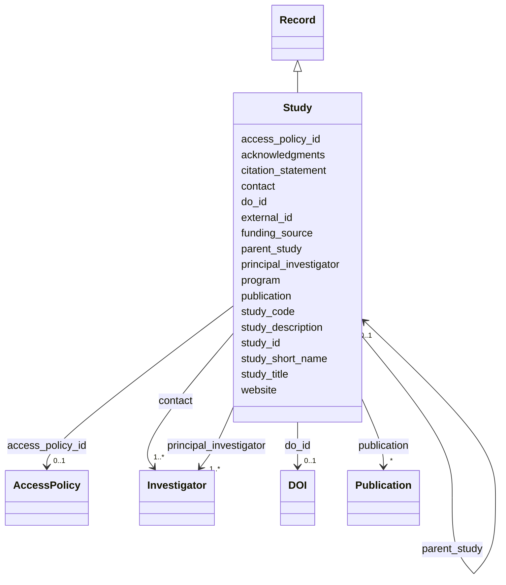

---
search:
  boost: 10.0
---

# Class: Research Study (Study) 


_Study Metadata_


<div data-search-exclude markdown="1">


URI: [acr_harmonized_data_model:Study](https://w3id.org/anvilproject/acr-harmonized-data-model/Study)





## Inheritance
* **Study** [ [Record](Record.md)]


## Slots

| Name | Cardinality and Range | Description | Inheritance |
| ---  | --- | --- | --- |
| [parent_study](parent_study.md) | 0..1 <br/> [Study](Study.md) | The parent study for this study, if it is a nested study | direct |
| [study_title](study_title.md) | 1 <br/> [String](String.md) | Full Study Title | direct |
| [study_code](study_code.md) | 1 <br/> [String](String.md) | Unique identifier for the study (generally a short acronym) | direct |
| [study_short_name](study_short_name.md) | 0..1 <br/> [String](String.md) | Short name for the study | direct |
| [program](program.md) | 1..* <br/> [Uriorcurie](Uriorcurie.md)&nbsp;or&nbsp;<br />[EnumProgram](EnumProgram.md) | Funding source(s) for the study | direct |
| [funding_source](funding_source.md) | * <br/> [String](String.md) | The funding source(s) of the study | direct |
| [principal_investigator](principal_investigator.md) | 1..* <br/> [Investigator](Investigator.md) | The Principal Investigator(s) responsible for the study | direct |
| [contact](contact.md) | 1..* <br/> [Investigator](Investigator.md) | The individual to contact with questions about this record | direct |
| [study_description](study_description.md) | 1 <br/> [String](String.md) | Brief description of the study (2-4 sentences) | direct |
| [website](website.md) | 0..1 <br/> [Uri](Uri.md) | Website with more information about this entity | direct |
| [publication](publication.md) | * <br/> [Publication](Publication.md) | Publications associated with this Record | direct |
| [acknowledgments](acknowledgments.md) | 0..1 <br/> [String](String.md) | Funding statement and acknowledgments for this study | direct |
| [citation_statement](citation_statement.md) | 0..1 <br/> [String](String.md) | Statement that secondary data users should use to acknowledge use of this stu... | direct |
| [do_id](do_id.md) | 0..1 <br/> [DOI](DOI.md) | Digital Object Identifier (DOI) for this Record | direct |
| [external_id](external_id.md) | * <br/> [Uriorcurie](Uriorcurie.md) | Other identifiers for this entity, eg, from the submitting study or in system... | [Record](Record.md) |
| [access_policy_id](access_policy_id.md) | 0..1 <br/> [AccessPolicy](AccessPolicy.md) | Global identifier for the access policy that applies to this row of data | [Record](Record.md) |
| [study_id](study_id.md) | 1 <br/> [SdGlobalID](SdGlobalID.md) | INCLUDE Global ID for the study | [Record](Record.md) |


## Usages

| used by | used in | type | used |
| ---  | --- | --- | --- |
| [Record](Record.md) | [study_id](study_id.md) | range | [Study](Study.md) |
| [Study](Study.md) | [parent_study](parent_study.md) | range | [Study](Study.md) |
| [StudyMetadata](StudyMetadata.md) | [study_id](study_id.md) | range | [Study](Study.md) |
| [VirtualBiorepository](VirtualBiorepository.md) | [study_id](study_id.md) | range | [Study](Study.md) |
| [DOI](DOI.md) | [study_id](study_id.md) | range | [Study](Study.md) |
| [Investigator](Investigator.md) | [study_id](study_id.md) | range | [Study](Study.md) |
| [Publication](Publication.md) | [study_id](study_id.md) | range | [Study](Study.md) |
| [Subject](Subject.md) | [study_id](study_id.md) | range | [Study](Study.md) |
| [Demographics](Demographics.md) | [study_id](study_id.md) | range | [Study](Study.md) |
| [Family](Family.md) | [study_id](study_id.md) | range | [Study](Study.md) |
| [FamilyRelationship](FamilyRelationship.md) | [study_id](study_id.md) | range | [Study](Study.md) |
| [FamilyMembership](FamilyMembership.md) | [study_id](study_id.md) | range | [Study](Study.md) |
| [SubjectAssertion](SubjectAssertion.md) | [study_id](study_id.md) | range | [Study](Study.md) |
| [Sample](Sample.md) | [study_id](study_id.md) | range | [Study](Study.md) |
| [BiospecimenCollection](BiospecimenCollection.md) | [study_id](study_id.md) | range | [Study](Study.md) |
| [Aliquot](Aliquot.md) | [study_id](study_id.md) | range | [Study](Study.md) |
| [Encounter](Encounter.md) | [study_id](study_id.md) | range | [Study](Study.md) |
| [EncounterDefinition](EncounterDefinition.md) | [study_id](study_id.md) | range | [Study](Study.md) |
| [ActivityDefinition](ActivityDefinition.md) | [study_id](study_id.md) | range | [Study](Study.md) |
| [File](File.md) | [study_id](study_id.md) | range | [Study](Study.md) |
| [Assay](Assay.md) | [study_id](study_id.md) | range | [Study](Study.md) |


## Identifier and Mapping Information


### Schema Source


* from schema: https://w3id.org/anvilproject/acr-harmonized-data-model


## Mappings

| Mapping Type | Mapped Value |
| ---  | ---  |
| self | acr_harmonized_data_model:Study |
| native | acr_harmonized_data_model:Study |


## LinkML Source

<!-- TODO: investigate https://stackoverflow.com/questions/37606292/how-to-create-tabbed-code-blocks-in-mkdocs-or-sphinx -->

### Direct

<details>
```yaml
name: Study
description: Study Metadata
title: Research Study
from_schema: https://w3id.org/anvilproject/acr-harmonized-data-model
mixins:
- Record
slots:
- parent_study
- study_title
- study_code
- study_short_name
- program
- funding_source
- principal_investigator
- contact
- study_description
- website
- publication
- acknowledgments
- citation_statement
- do_id
slot_usage:
  study_id:
    name: study_id
    identifier: true
    range: sdGlobalID
    required: true

```
</details>

### Induced

<details>
```yaml
name: Study
description: Study Metadata
title: Research Study
from_schema: https://w3id.org/anvilproject/acr-harmonized-data-model
mixins:
- Record
slot_usage:
  study_id:
    name: study_id
    identifier: true
    range: sdGlobalID
    required: true
attributes:
  parent_study:
    name: parent_study
    description: The parent study for this study, if it is a nested study.
    title: Parent Study
    from_schema: https://w3id.org/anvilproject/acr-harmonized-data-model
    rank: 1000
    owner: Study
    domain_of:
    - Study
    range: Study
    required: false
    multivalued: false
  study_title:
    name: study_title
    description: Full Study Title
    from_schema: https://w3id.org/anvilproject/acr-harmonized-data-model
    rank: 1000
    owner: Study
    domain_of:
    - Study
    range: string
    required: true
    multivalued: false
  study_code:
    name: study_code
    description: Unique identifier for the study (generally a short acronym)
    title: Study Code
    from_schema: https://w3id.org/anvilproject/acr-harmonized-data-model
    rank: 1000
    owner: Study
    domain_of:
    - Study
    range: string
    required: true
  study_short_name:
    name: study_short_name
    description: Short name for the study
    title: Study Code
    from_schema: https://w3id.org/anvilproject/acr-harmonized-data-model
    rank: 1000
    owner: Study
    domain_of:
    - Study
    range: string
    required: false
  program:
    name: program
    description: Funding source(s) for the study
    title: Program
    from_schema: https://w3id.org/anvilproject/acr-harmonized-data-model
    rank: 1000
    owner: Study
    domain_of:
    - Study
    range: uriorcurie
    required: true
    multivalued: true
    any_of:
    - range: uriorcurie
    - range: EnumProgram
  funding_source:
    name: funding_source
    description: The funding source(s) of the study.
    title: Funding Source
    from_schema: https://w3id.org/anvilproject/acr-harmonized-data-model
    rank: 1000
    owner: Study
    domain_of:
    - Study
    range: string
    required: false
    multivalued: true
  principal_investigator:
    name: principal_investigator
    description: The Principal Investigator(s) responsible for the study.
    title: Principal Investigator
    from_schema: https://w3id.org/anvilproject/acr-harmonized-data-model
    rank: 1000
    owner: Study
    domain_of:
    - Study
    range: Investigator
    required: true
    multivalued: true
  contact:
    name: contact
    description: The individual to contact with questions about this record.
    title: Contact Person
    from_schema: https://w3id.org/anvilproject/acr-harmonized-data-model
    rank: 1000
    owner: Study
    domain_of:
    - Study
    - VirtualBiorepository
    range: Investigator
    required: true
    multivalued: true
  study_description:
    name: study_description
    description: Brief description of the study (2-4 sentences)
    title: Study Description
    from_schema: https://w3id.org/anvilproject/acr-harmonized-data-model
    rank: 1000
    owner: Study
    domain_of:
    - Study
    range: string
    required: true
  website:
    name: website
    description: Website with more information about this entity.
    title: Website
    from_schema: https://w3id.org/anvilproject/acr-harmonized-data-model
    rank: 1000
    owner: Study
    domain_of:
    - AccessPolicy
    - Study
    - VirtualBiorepository
    - Publication
    range: uri
  publication:
    name: publication
    description: Publications associated with this Record.
    title: Publication
    from_schema: https://w3id.org/anvilproject/acr-harmonized-data-model
    rank: 1000
    owner: Study
    domain_of:
    - Study
    - Dataset
    range: Publication
    multivalued: true
  acknowledgments:
    name: acknowledgments
    description: Funding statement and acknowledgments for this study
    title: Acknowledgments
    from_schema: https://w3id.org/anvilproject/acr-harmonized-data-model
    rank: 1000
    owner: Study
    domain_of:
    - Study
    range: string
  citation_statement:
    name: citation_statement
    description: Statement that secondary data users should use to acknowledge use
      of this study or dataset. E.g., "The results analyzed and <published or shown>
      here are based in whole or in part upon data generated by the INCLUDE (INvestigation
      of Co-occurring conditions across the Lifespan to Understand Down syndromeE)
      Project <insert accession number(s) and/or study DOI(s)>, and were accessed
      from the INCLUDE Data Hub and <insert other database(s)>."
    title: Citation Statement
    from_schema: https://w3id.org/anvilproject/acr-harmonized-data-model
    rank: 1000
    owner: Study
    domain_of:
    - Study
    range: string
  do_id:
    name: do_id
    description: Digital Object Identifier (DOI) for this Record.
    title: DOI
    from_schema: https://w3id.org/anvilproject/acr-harmonized-data-model
    rank: 1000
    owner: Study
    domain_of:
    - Study
    - DOI
    - Dataset
    range: DOI
    multivalued: false
  external_id:
    name: external_id
    description: Other identifiers for this entity, eg, from the submitting study
      or in systems like dbGaP
    title: External Identifiers
    from_schema: https://w3id.org/anvilproject/acr-harmonized-data-model
    rank: 1000
    owner: Study
    domain_of:
    - Record
    range: uriorcurie
    required: false
    multivalued: true
  access_policy_id:
    name: access_policy_id
    description: Global identifier for the access policy that applies to this row
      of data.
    title: Access Policy ID
    from_schema: https://w3id.org/anvilproject/acr-harmonized-data-model
    rank: 1000
    owner: Study
    domain_of:
    - Record
    - AccessPolicy
    range: AccessPolicy
  study_id:
    name: study_id
    description: INCLUDE Global ID for the study
    title: Study ID
    from_schema: https://w3id.org/anvilproject/acr-harmonized-data-model
    rank: 1000
    identifier: true
    owner: Study
    domain_of:
    - Record
    - StudyMetadata
    range: sdGlobalID
    required: true
    multivalued: false

```
</details></div>