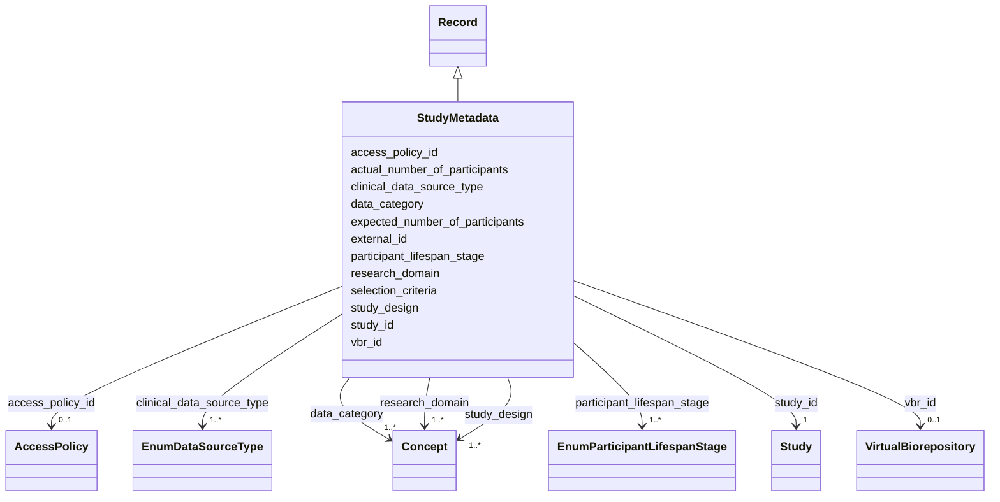

---
search:
  boost: 10.0
---

# Class: Study Metadata (StudyMetadata) 


_Additional features about studies that may not apply to all studies_


<div data-search-exclude markdown="1">


URI: [acr_harmonized_data_model:StudyMetadata](https://w3id.org/anvilproject/acr-harmonized-data-model/StudyMetadata)





## Inheritance
* **StudyMetadata** [ [Record](Record.md)]


## Slots

| Name | Cardinality and Range | Description | Inheritance |
| ---  | --- | --- | --- |
| [study_id](study_id.md) | 1 <br/> [Study](Study.md) | INCLUDE Global ID for the study | direct |
| [participant_lifespan_stage](participant_lifespan_stage.md) | 1..* <br/> [EnumParticipantLifespanStage](EnumParticipantLifespanStage.md) | Focus age group(s) of the study population | direct |
| [selection_criteria](selection_criteria.md) | 0..1 <br/> [String](String.md) | Brief description of inclusion and/or exclusion criteria for the study | direct |
| [study_design](study_design.md) | 1..* <br/> [Concept](Concept.md)&nbsp;or&nbsp;<br />[EnumStudyDesign](EnumStudyDesign.md) | Overall design of study, including whether it is longitudinal and whether fam... | direct |
| [clinical_data_source_type](clinical_data_source_type.md) | 1..* <br/> [EnumDataSourceType](EnumDataSourceType.md) | Source(s) of data collected from study participants | direct |
| [data_category](data_category.md) | 1..* <br/> [Concept](Concept.md)&nbsp;or&nbsp;<br />[EnumDataCategory](EnumDataCategory.md) | General category of data in this Record (e | direct |
| [vbr_id](vbr_id.md) | 0..1 <br/> [VirtualBiorepository](VirtualBiorepository.md) | Information about the study's Virtual Biorepository, if participating | direct |
| [research_domain](research_domain.md) | 1..* <br/> [Concept](Concept.md)&nbsp;or&nbsp;<br />[EnumResearchDomain](EnumResearchDomain.md) | Main research domain(s) of the study | direct |
| [expected_number_of_participants](expected_number_of_participants.md) | 1 <br/> [Integer](Integer.md) | Total expected number of participants to be recruited | direct |
| [actual_number_of_participants](actual_number_of_participants.md) | 1 <br/> [Integer](Integer.md) | Total participants included at this time | direct |
| [external_id](external_id.md) | * <br/> [Uriorcurie](Uriorcurie.md) | Other identifiers for this entity, eg, from the submitting study or in system... | [Record](Record.md) |
| [access_policy_id](access_policy_id.md) | 0..1 <br/> [AccessPolicy](AccessPolicy.md) | Global identifier for the access policy that applies to this row of data | [Record](Record.md) |


## Identifier and Mapping Information


### Schema Source


* from schema: https://w3id.org/anvilproject/acr-harmonized-data-model


## Mappings

| Mapping Type | Mapped Value |
| ---  | ---  |
| self | acr_harmonized_data_model:StudyMetadata |
| native | acr_harmonized_data_model:StudyMetadata |


## LinkML Source

<!-- TODO: investigate https://stackoverflow.com/questions/37606292/how-to-create-tabbed-code-blocks-in-mkdocs-or-sphinx -->

### Direct

<details>
```yaml
name: StudyMetadata
description: Additional features about studies that may not apply to all studies
title: Study Metadata
from_schema: https://w3id.org/anvilproject/acr-harmonized-data-model
mixins:
- Record
slots:
- study_id
- participant_lifespan_stage
- selection_criteria
- study_design
- clinical_data_source_type
- data_category
- vbr_id
- research_domain
- expected_number_of_participants
- actual_number_of_participants
slot_usage:
  study_id:
    name: study_id
    identifier: true
    required: true
  data_category:
    name: data_category
    required: true
    multivalued: true

```
</details>

### Induced

<details>
```yaml
name: StudyMetadata
description: Additional features about studies that may not apply to all studies
title: Study Metadata
from_schema: https://w3id.org/anvilproject/acr-harmonized-data-model
mixins:
- Record
slot_usage:
  study_id:
    name: study_id
    identifier: true
    required: true
  data_category:
    name: data_category
    required: true
    multivalued: true
attributes:
  study_id:
    name: study_id
    description: INCLUDE Global ID for the study
    title: Study ID
    from_schema: https://w3id.org/anvilproject/acr-harmonized-data-model
    rank: 1000
    identifier: true
    owner: StudyMetadata
    domain_of:
    - Record
    - StudyMetadata
    range: Study
    required: true
    multivalued: false
  participant_lifespan_stage:
    name: participant_lifespan_stage
    description: Focus age group(s) of the study population
    title: Participant Lifespan Stage
    from_schema: https://w3id.org/anvilproject/acr-harmonized-data-model
    rank: 1000
    owner: StudyMetadata
    domain_of:
    - StudyMetadata
    range: EnumParticipantLifespanStage
    required: true
    multivalued: true
  selection_criteria:
    name: selection_criteria
    description: Brief description of inclusion and/or exclusion criteria for the
      study
    title: Selection Criteria
    from_schema: https://w3id.org/anvilproject/acr-harmonized-data-model
    rank: 1000
    owner: StudyMetadata
    domain_of:
    - StudyMetadata
    range: string
  study_design:
    name: study_design
    description: Overall design of study, including whether it is longitudinal and
      whether family members/unrelated controls are also enrolled
    title: Study Design
    from_schema: https://w3id.org/anvilproject/acr-harmonized-data-model
    rank: 1000
    owner: StudyMetadata
    domain_of:
    - StudyMetadata
    range: Concept
    required: true
    multivalued: true
    any_of:
    - range: Concept
    - range: EnumStudyDesign
  clinical_data_source_type:
    name: clinical_data_source_type
    description: Source(s) of data collected from study participants
    title: Clinical Data Source Type
    from_schema: https://w3id.org/anvilproject/acr-harmonized-data-model
    rank: 1000
    owner: StudyMetadata
    domain_of:
    - StudyMetadata
    range: EnumDataSourceType
    required: true
    multivalued: true
  data_category:
    name: data_category
    description: General category of data in this Record (e.g. Clinical, Genomics,
      etc)
    title: Data Category
    from_schema: https://w3id.org/anvilproject/acr-harmonized-data-model
    rank: 1000
    owner: StudyMetadata
    domain_of:
    - StudyMetadata
    - File
    range: Concept
    required: true
    multivalued: true
    any_of:
    - range: Concept
    - range: EnumDataCategory
  vbr_id:
    name: vbr_id
    description: Information about the study's Virtual Biorepository, if participating
    title: Virtual Biorepository
    from_schema: https://w3id.org/anvilproject/acr-harmonized-data-model
    rank: 1000
    owner: StudyMetadata
    domain_of:
    - StudyMetadata
    - VirtualBiorepository
    range: VirtualBiorepository
  research_domain:
    name: research_domain
    description: Main research domain(s) of the study
    from_schema: https://w3id.org/anvilproject/acr-harmonized-data-model
    rank: 1000
    owner: StudyMetadata
    domain_of:
    - StudyMetadata
    range: Concept
    required: true
    multivalued: true
    any_of:
    - range: Concept
    - range: EnumResearchDomain
  expected_number_of_participants:
    name: expected_number_of_participants
    description: Total expected number of participants to be recruited.
    title: Expected Number of Participants
    from_schema: https://w3id.org/anvilproject/acr-harmonized-data-model
    rank: 1000
    owner: StudyMetadata
    domain_of:
    - StudyMetadata
    range: integer
    required: true
  actual_number_of_participants:
    name: actual_number_of_participants
    description: Total participants included at this time.
    title: Actual Number of Participants
    from_schema: https://w3id.org/anvilproject/acr-harmonized-data-model
    rank: 1000
    owner: StudyMetadata
    domain_of:
    - StudyMetadata
    range: integer
    required: true
  external_id:
    name: external_id
    description: Other identifiers for this entity, eg, from the submitting study
      or in systems like dbGaP
    title: External Identifiers
    from_schema: https://w3id.org/anvilproject/acr-harmonized-data-model
    rank: 1000
    owner: StudyMetadata
    domain_of:
    - Record
    range: uriorcurie
    required: false
    multivalued: true
  access_policy_id:
    name: access_policy_id
    description: Global identifier for the access policy that applies to this row
      of data.
    title: Access Policy ID
    from_schema: https://w3id.org/anvilproject/acr-harmonized-data-model
    rank: 1000
    owner: StudyMetadata
    domain_of:
    - Record
    - AccessPolicy
    range: AccessPolicy

```
</details></div>