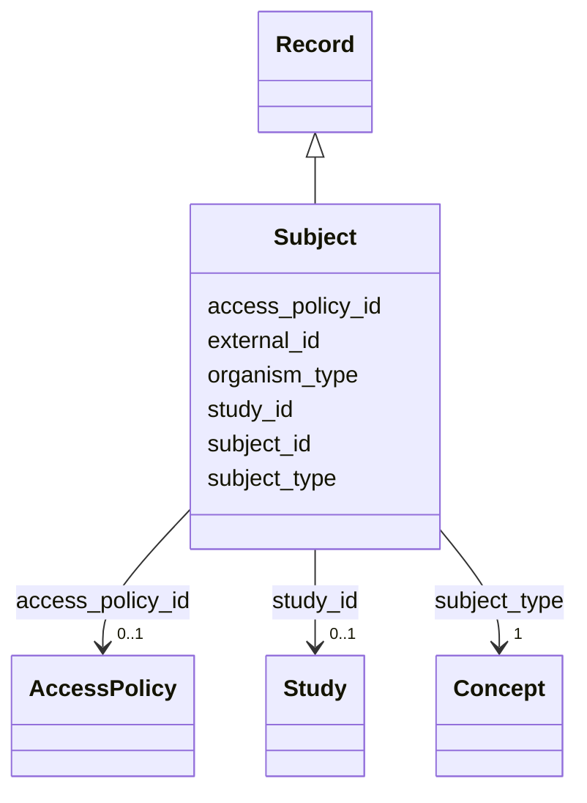

---
search:
  boost: 10.0
---

# Class: Subject (Subject) 


_This entity is the subject about which data or references are recorded. This includes the idea of a human participant in a study, a cell line, an animal model, or any other similar entity._


<div data-search-exclude markdown="1">


URI: [acr_harmonized_data_model:Subject](https://w3id.org/anvilproject/acr-harmonized-data-model/Subject)





## Inheritance
* **Subject** [ [Record](Record.md)]


## Slots

| Name | Cardinality and Range | Description | Inheritance |
| ---  | --- | --- | --- |
| [subject_id](subject_id.md) | 1 <br/> [PtGlobalID](PtGlobalID.md) | INCLUDE Global ID for the Subject | direct |
| [subject_type](subject_type.md) | 1 <br/> [Concept](Concept.md)&nbsp;or&nbsp;<br />[EnumSubjectType](EnumSubjectType.md)&nbsp;or&nbsp;<br />[EnumUnknownOther](EnumUnknownOther.md) | Type of entity this record represents | direct |
| [organism_type](organism_type.md) | 0..1 <br/> [Uriorcurie](Uriorcurie.md)&nbsp;or&nbsp;<br />[EnumOrganism](EnumOrganism.md) | Organism Type, typically from NCBITaxon | direct |
| [external_id](external_id.md) | * <br/> [Uriorcurie](Uriorcurie.md) | Other identifiers for this entity, eg, from the submitting study or in system... | [Record](Record.md) |
| [access_policy_id](access_policy_id.md) | 0..1 <br/> [AccessPolicy](AccessPolicy.md) | Global identifier for the access policy that applies to this row of data | [Record](Record.md) |
| [study_id](study_id.md) | 0..1 <br/> [Study](Study.md) | INCLUDE Global ID for the study | [Record](Record.md) |


## Usages

| used by | used in | type | used |
| ---  | --- | --- | --- |
| [Demographics](Demographics.md) | [subject_id](subject_id.md) | range | [Subject](Subject.md) |
| [FamilyRelationship](FamilyRelationship.md) | [family_member_id](family_member_id.md) | range | [Subject](Subject.md) |
| [FamilyRelationship](FamilyRelationship.md) | [subject_id](subject_id.md) | range | [Subject](Subject.md) |
| [FamilyMembership](FamilyMembership.md) | [subject_id](subject_id.md) | range | [Subject](Subject.md) |
| [SubjectAssertion](SubjectAssertion.md) | [subject_id](subject_id.md) | range | [Subject](Subject.md) |
| [Encounter](Encounter.md) | [subject_id](subject_id.md) | range | [Subject](Subject.md) |
| [File](File.md) | [subject_id](subject_id.md) | range | [Subject](Subject.md) |
| [Assay](Assay.md) | [subject_id](subject_id.md) | range | [Subject](Subject.md) |


## Identifier and Mapping Information


### Schema Source


* from schema: https://w3id.org/anvilproject/acr-harmonized-data-model


## Mappings

| Mapping Type | Mapped Value |
| ---  | ---  |
| self | acr_harmonized_data_model:Subject |
| native | acr_harmonized_data_model:Subject |


## LinkML Source

<!-- TODO: investigate https://stackoverflow.com/questions/37606292/how-to-create-tabbed-code-blocks-in-mkdocs-or-sphinx -->

### Direct

<details>
```yaml
name: Subject
description: This entity is the subject about which data or references are recorded.
  This includes the idea of a human participant in a study, a cell line, an animal
  model, or any other similar entity.
title: Subject
from_schema: https://w3id.org/anvilproject/acr-harmonized-data-model
mixins:
- Record
slots:
- subject_id
- subject_type
- organism_type
slot_usage:
  subject_id:
    name: subject_id
    identifier: true
    range: ptGlobalID
    required: true

```
</details>

### Induced

<details>
```yaml
name: Subject
description: This entity is the subject about which data or references are recorded.
  This includes the idea of a human participant in a study, a cell line, an animal
  model, or any other similar entity.
title: Subject
from_schema: https://w3id.org/anvilproject/acr-harmonized-data-model
mixins:
- Record
slot_usage:
  subject_id:
    name: subject_id
    identifier: true
    range: ptGlobalID
    required: true
attributes:
  subject_id:
    name: subject_id
    description: INCLUDE Global ID for the Subject
    title: Study ID
    from_schema: https://w3id.org/anvilproject/acr-harmonized-data-model
    rank: 1000
    identifier: true
    owner: Subject
    domain_of:
    - Subject
    - Demographics
    - FamilyRelationship
    - FamilyMembership
    - SubjectAssertion
    - Encounter
    - File
    - Assay
    range: ptGlobalID
    required: true
    multivalued: false
  subject_type:
    name: subject_type
    description: Type of entity this record represents
    title: Subject Type
    from_schema: https://w3id.org/anvilproject/acr-harmonized-data-model
    rank: 1000
    owner: Subject
    domain_of:
    - Subject
    range: Concept
    required: true
    any_of:
    - range: EnumSubjectType
    - range: EnumUnknownOther
  organism_type:
    name: organism_type
    description: Organism Type, typically from NCBITaxon.
    title: Organism Type
    from_schema: https://w3id.org/anvilproject/acr-harmonized-data-model
    rank: 1000
    owner: Subject
    domain_of:
    - Subject
    range: uriorcurie
    any_of:
    - range: uriorcurie
    - range: EnumOrganism
  external_id:
    name: external_id
    description: Other identifiers for this entity, eg, from the submitting study
      or in systems like dbGaP
    title: External Identifiers
    from_schema: https://w3id.org/anvilproject/acr-harmonized-data-model
    rank: 1000
    owner: Subject
    domain_of:
    - Record
    range: uriorcurie
    required: false
    multivalued: true
  access_policy_id:
    name: access_policy_id
    description: Global identifier for the access policy that applies to this row
      of data.
    title: Access Policy ID
    from_schema: https://w3id.org/anvilproject/acr-harmonized-data-model
    rank: 1000
    owner: Subject
    domain_of:
    - Record
    - AccessPolicy
    range: AccessPolicy
  study_id:
    name: study_id
    description: INCLUDE Global ID for the study
    title: Study ID
    from_schema: https://w3id.org/anvilproject/acr-harmonized-data-model
    rank: 1000
    owner: Subject
    domain_of:
    - Record
    - StudyMetadata
    range: Study
    multivalued: false

```
</details></div>