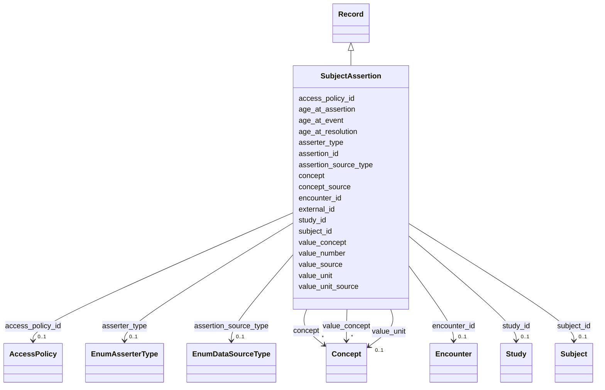

---
search:
  boost: 10.0
---

# Class: Subject Assertion (SubjectAssertion) 


_Assertion about a particular Subject. May include Conditions, Measurements, etc._


<div data-search-exclude markdown="1">


URI: [acr_harmonized_data_model:SubjectAssertion](https://w3id.org/anvilproject/acr-harmonized-data-model/SubjectAssertion)





## Inheritance
* **SubjectAssertion** [ [Record](Record.md)]


## Slots

| Name | Cardinality and Range | Description | Inheritance |
| ---  | --- | --- | --- |
| [assertion_id](assertion_id.md) | 1 <br/> [ObGlobalID](ObGlobalID.md)&nbsp;or&nbsp;<br />[DeGlobalID](DeGlobalID.md)&nbsp;or&nbsp;<br />[MsGlobalID](MsGlobalID.md) | INCLUDE Global ID for the Assertion | direct |
| [subject_id](subject_id.md) | 0..1 <br/> [Subject](Subject.md) | INCLUDE Global ID for the Subject | direct |
| [encounter_id](encounter_id.md) | 0..1 <br/> [Encounter](Encounter.md) | Unique identifier for this Encounter | direct |
| [asserter_type](asserter_type.md) | 0..1 <br/> [EnumAsserterType](EnumAsserterType.md) | The original asserter of this information | direct |
| [assertion_source_type](assertion_source_type.md) | 0..1 <br/> [EnumDataSourceType](EnumDataSourceType.md) | The source of this assertion from the original data | direct |
| [age_at_assertion](age_at_assertion.md) | 0..1 <br/> [Integer](Integer.md) | The age in days of the Subject when the assertion was made | direct |
| [age_at_event](age_at_event.md) | 0..1 <br/> [Integer](Integer.md) | The age in days of the Subject at the time point which the assertion describe... | direct |
| [age_at_resolution](age_at_resolution.md) | 0..1 <br/> [Integer](Integer.md) | The age in days of the Subject when the asserted state was resolved | direct |
| [concept](concept.md) | * <br/> [Concept](Concept.md) | The structured term defining the meaning of the assertion | direct |
| [concept_source](concept_source.md) | 0..1 <br/> [String](String.md) | The source text yielding the standardized concept | direct |
| [value_concept](value_concept.md) | * <br/> [Concept](Concept.md)&nbsp;or&nbsp;<br />[EnumPresentAbsent](EnumPresentAbsent.md) | The structured term defining the value of the assertion | direct |
| [value_number](value_number.md) | 0..1 <br/> [Float](Float.md) | The numeric value of the assertion | direct |
| [value_source](value_source.md) | 0..1 <br/> [String](String.md) | The source text yielding the value | direct |
| [value_unit](value_unit.md) | 0..1 <br/> [Concept](Concept.md) | The structured term defining the units of the value | direct |
| [value_unit_source](value_unit_source.md) | 0..1 <br/> [String](String.md) | The source text yielding the value's units | direct |
| [external_id](external_id.md) | * <br/> [Uriorcurie](Uriorcurie.md) | Other identifiers for this entity, eg, from the submitting study or in system... | [Record](Record.md) |
| [access_policy_id](access_policy_id.md) | 0..1 <br/> [AccessPolicy](AccessPolicy.md) | Global identifier for the access policy that applies to this row of data | [Record](Record.md) |
| [study_id](study_id.md) | 0..1 <br/> [Study](Study.md) | INCLUDE Global ID for the study | [Record](Record.md) |


## Identifier and Mapping Information


### Schema Source


* from schema: https://w3id.org/anvilproject/acr-harmonized-data-model


## Mappings

| Mapping Type | Mapped Value |
| ---  | ---  |
| self | acr_harmonized_data_model:SubjectAssertion |
| native | acr_harmonized_data_model:SubjectAssertion |


## LinkML Source

<!-- TODO: investigate https://stackoverflow.com/questions/37606292/how-to-create-tabbed-code-blocks-in-mkdocs-or-sphinx -->

### Direct

<details>
```yaml
name: SubjectAssertion
description: Assertion about a particular Subject. May include Conditions, Measurements,
  etc.
title: Subject Assertion
from_schema: https://w3id.org/anvilproject/acr-harmonized-data-model
mixins:
- Record
slots:
- assertion_id
- subject_id
- encounter_id
- asserter_type
- assertion_source_type
- age_at_assertion
- age_at_event
- age_at_resolution
- concept
- concept_source
- value_concept
- value_number
- value_source
- value_unit
- value_unit_source
slot_usage:
  assertion_id:
    name: assertion_id
    identifier: true
    range: string
    required: true
    any_of:
    - range: obGlobalID
    - range: deGlobalID
    - range: msGlobalID

```
</details>

### Induced

<details>
```yaml
name: SubjectAssertion
description: Assertion about a particular Subject. May include Conditions, Measurements,
  etc.
title: Subject Assertion
from_schema: https://w3id.org/anvilproject/acr-harmonized-data-model
mixins:
- Record
slot_usage:
  assertion_id:
    name: assertion_id
    identifier: true
    range: string
    required: true
    any_of:
    - range: obGlobalID
    - range: deGlobalID
    - range: msGlobalID
attributes:
  assertion_id:
    name: assertion_id
    description: INCLUDE Global ID for the Assertion
    title: Assertion ID
    from_schema: https://w3id.org/anvilproject/acr-harmonized-data-model
    rank: 1000
    identifier: true
    owner: SubjectAssertion
    domain_of:
    - SubjectAssertion
    range: string
    required: true
    multivalued: false
    any_of:
    - range: obGlobalID
    - range: deGlobalID
    - range: msGlobalID
  subject_id:
    name: subject_id
    description: INCLUDE Global ID for the Subject
    title: Study ID
    from_schema: https://w3id.org/anvilproject/acr-harmonized-data-model
    rank: 1000
    owner: SubjectAssertion
    domain_of:
    - Subject
    - Demographics
    - FamilyRelationship
    - FamilyMembership
    - SubjectAssertion
    - Encounter
    - File
    - Assay
    range: Subject
    multivalued: false
  encounter_id:
    name: encounter_id
    description: Unique identifier for this Encounter.
    title: Encounter ID
    from_schema: https://w3id.org/anvilproject/acr-harmonized-data-model
    rank: 1000
    owner: SubjectAssertion
    domain_of:
    - SubjectAssertion
    - BiospecimenCollection
    - Encounter
    range: Encounter
  asserter_type:
    name: asserter_type
    description: The original asserter of this information
    title: Asserter Type
    from_schema: https://w3id.org/anvilproject/acr-harmonized-data-model
    rank: 1000
    owner: SubjectAssertion
    domain_of:
    - SubjectAssertion
    range: EnumAsserterType
  assertion_source_type:
    name: assertion_source_type
    description: The source of this assertion from the original data
    title: Assertion Source
    from_schema: https://w3id.org/anvilproject/acr-harmonized-data-model
    rank: 1000
    owner: SubjectAssertion
    domain_of:
    - SubjectAssertion
    range: EnumDataSourceType
  age_at_assertion:
    name: age_at_assertion
    description: The age in days of the Subject when the assertion was made.
    title: Age at assertion
    from_schema: https://w3id.org/anvilproject/acr-harmonized-data-model
    rank: 1000
    owner: SubjectAssertion
    domain_of:
    - SubjectAssertion
    range: integer
    unit:
      ucum_code: d
  age_at_event:
    name: age_at_event
    description: The age in days of the Subject at the time point which the assertion
      describes, eg, age of onset or when a measurement was performed.
    title: Age at event
    from_schema: https://w3id.org/anvilproject/acr-harmonized-data-model
    rank: 1000
    owner: SubjectAssertion
    domain_of:
    - SubjectAssertion
    - Encounter
    range: integer
    unit:
      ucum_code: d
  age_at_resolution:
    name: age_at_resolution
    description: The age in days of the Subject when the asserted state was resolved.
    title: Age at resolution
    from_schema: https://w3id.org/anvilproject/acr-harmonized-data-model
    rank: 1000
    owner: SubjectAssertion
    domain_of:
    - SubjectAssertion
    range: integer
    unit:
      ucum_code: d
  concept:
    name: concept
    description: The structured term defining the meaning of the assertion.
    title: Concept
    from_schema: https://w3id.org/anvilproject/acr-harmonized-data-model
    rank: 1000
    owner: SubjectAssertion
    domain_of:
    - SubjectAssertion
    range: Concept
    multivalued: true
  concept_source:
    name: concept_source
    description: The source text yielding the standardized concept.
    title: Concept Source Text
    from_schema: https://w3id.org/anvilproject/acr-harmonized-data-model
    rank: 1000
    owner: SubjectAssertion
    domain_of:
    - SubjectAssertion
    range: string
  value_concept:
    name: value_concept
    description: The structured term defining the value of the assertion.
    title: Value concept
    from_schema: https://w3id.org/anvilproject/acr-harmonized-data-model
    rank: 1000
    owner: SubjectAssertion
    domain_of:
    - SubjectAssertion
    range: Concept
    multivalued: true
    any_of:
    - range: Concept
    - range: EnumPresentAbsent
  value_number:
    name: value_number
    description: The numeric value of the assertion.
    title: Value Number
    from_schema: https://w3id.org/anvilproject/acr-harmonized-data-model
    rank: 1000
    owner: SubjectAssertion
    domain_of:
    - SubjectAssertion
    range: float
  value_source:
    name: value_source
    description: The source text yielding the value.
    title: Value Source Text
    from_schema: https://w3id.org/anvilproject/acr-harmonized-data-model
    rank: 1000
    owner: SubjectAssertion
    domain_of:
    - SubjectAssertion
    range: string
  value_unit:
    name: value_unit
    description: The structured term defining the units of the value.
    title: Value Units
    from_schema: https://w3id.org/anvilproject/acr-harmonized-data-model
    rank: 1000
    owner: SubjectAssertion
    domain_of:
    - SubjectAssertion
    range: Concept
  value_unit_source:
    name: value_unit_source
    description: The source text yielding the value's units.
    title: Value Units Source Text
    from_schema: https://w3id.org/anvilproject/acr-harmonized-data-model
    rank: 1000
    owner: SubjectAssertion
    domain_of:
    - SubjectAssertion
    range: string
  external_id:
    name: external_id
    description: Other identifiers for this entity, eg, from the submitting study
      or in systems like dbGaP
    title: External Identifiers
    from_schema: https://w3id.org/anvilproject/acr-harmonized-data-model
    rank: 1000
    owner: SubjectAssertion
    domain_of:
    - Record
    range: uriorcurie
    required: false
    multivalued: true
  access_policy_id:
    name: access_policy_id
    description: Global identifier for the access policy that applies to this row
      of data.
    title: Access Policy ID
    from_schema: https://w3id.org/anvilproject/acr-harmonized-data-model
    rank: 1000
    owner: SubjectAssertion
    domain_of:
    - Record
    - AccessPolicy
    range: AccessPolicy
  study_id:
    name: study_id
    description: INCLUDE Global ID for the study
    title: Study ID
    from_schema: https://w3id.org/anvilproject/acr-harmonized-data-model
    rank: 1000
    owner: SubjectAssertion
    domain_of:
    - Record
    - StudyMetadata
    range: Study
    multivalued: false

```
</details></div>