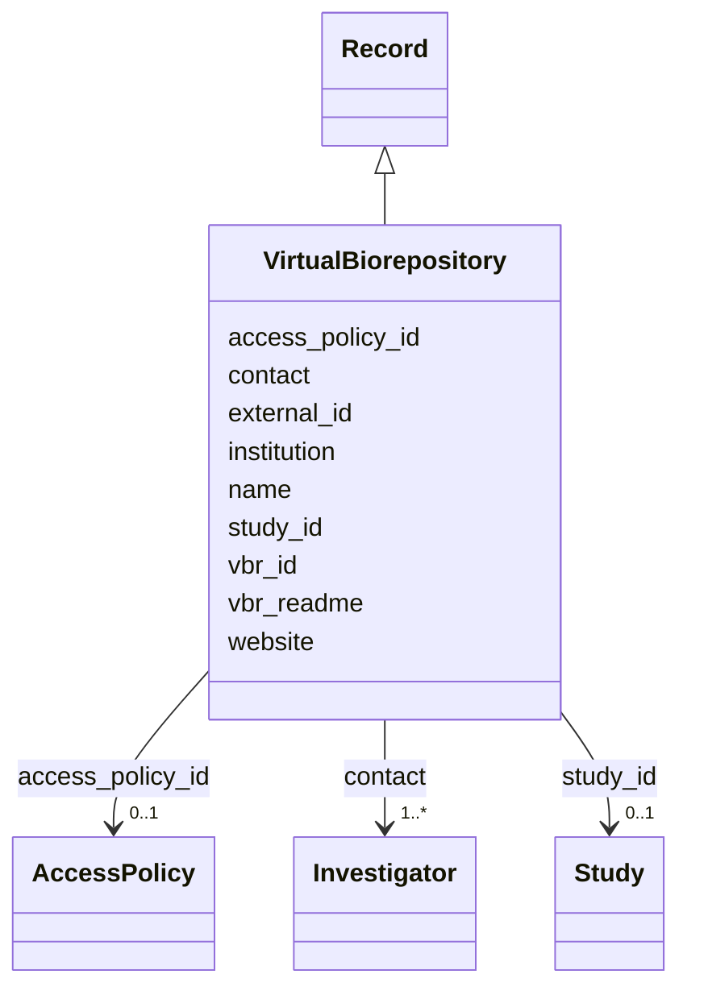

---
search:
  boost: 10.0
---

# Class: Virtual BioRepository (VBR) (VirtualBiorepository) 


_An organization that can provide access to specimen for further analysis._


<div data-search-exclude markdown="1">


URI: [acr_harmonized_data_model:VirtualBiorepository](https://w3id.org/anvilproject/acr-harmonized-data-model/VirtualBiorepository)





## Inheritance
* **VirtualBiorepository** [ [Record](Record.md)]


## Slots

| Name | Cardinality and Range | Description | Inheritance |
| ---  | --- | --- | --- |
| [vbr_id](vbr_id.md) | 1 <br/> [OrGlobalID](OrGlobalID.md) | Information about the study's Virtual Biorepository, if participating | direct |
| [name](name.md) | 0..1 <br/> [String](String.md) | Name of the entity | direct |
| [institution](institution.md) | 0..1 <br/> [String](String.md) | Name of the institution this record is associated with | direct |
| [contact](contact.md) | 1..* <br/> [Investigator](Investigator.md) | The individual to contact with questions about this record | direct |
| [website](website.md) | 0..1 <br/> [Uri](Uri.md) | Website with more information about this entity | direct |
| [vbr_readme](vbr_readme.md) | 0..1 <br/> [String](String.md) | Instructions for contacting or requesting samples from Virtual Biorepository,... | direct |
| [external_id](external_id.md) | * <br/> [Uriorcurie](Uriorcurie.md) | Other identifiers for this entity, eg, from the submitting study or in system... | [Record](Record.md) |
| [access_policy_id](access_policy_id.md) | 0..1 <br/> [AccessPolicy](AccessPolicy.md) | Global identifier for the access policy that applies to this row of data | [Record](Record.md) |
| [study_id](study_id.md) | 0..1 <br/> [Study](Study.md) | INCLUDE Global ID for the study | [Record](Record.md) |


## Usages

| used by | used in | type | used |
| ---  | --- | --- | --- |
| [StudyMetadata](StudyMetadata.md) | [vbr_id](vbr_id.md) | range | [VirtualBiorepository](VirtualBiorepository.md) |


## Identifier and Mapping Information


### Schema Source


* from schema: https://w3id.org/anvilproject/acr-harmonized-data-model


## Mappings

| Mapping Type | Mapped Value |
| ---  | ---  |
| self | acr_harmonized_data_model:VirtualBiorepository |
| native | acr_harmonized_data_model:VirtualBiorepository |


## LinkML Source

<!-- TODO: investigate https://stackoverflow.com/questions/37606292/how-to-create-tabbed-code-blocks-in-mkdocs-or-sphinx -->

### Direct

<details>
```yaml
name: VirtualBiorepository
description: An organization that can provide access to specimen for further analysis.
title: Virtual BioRepository (VBR)
from_schema: https://w3id.org/anvilproject/acr-harmonized-data-model
mixins:
- Record
slots:
- vbr_id
- name
- institution
- contact
- website
- vbr_readme
slot_usage:
  vbr_id:
    name: vbr_id
    identifier: true
    range: orGlobalID
    required: true

```
</details>

### Induced

<details>
```yaml
name: VirtualBiorepository
description: An organization that can provide access to specimen for further analysis.
title: Virtual BioRepository (VBR)
from_schema: https://w3id.org/anvilproject/acr-harmonized-data-model
mixins:
- Record
slot_usage:
  vbr_id:
    name: vbr_id
    identifier: true
    range: orGlobalID
    required: true
attributes:
  vbr_id:
    name: vbr_id
    description: Information about the study's Virtual Biorepository, if participating
    title: Virtual Biorepository
    from_schema: https://w3id.org/anvilproject/acr-harmonized-data-model
    rank: 1000
    identifier: true
    owner: VirtualBiorepository
    domain_of:
    - StudyMetadata
    - VirtualBiorepository
    range: orGlobalID
    required: true
  name:
    name: name
    description: Name of the entity.
    title: Name
    from_schema: https://w3id.org/anvilproject/acr-harmonized-data-model
    rank: 1000
    owner: VirtualBiorepository
    domain_of:
    - VirtualBiorepository
    - Investigator
    - EncounterDefinition
    - ActivityDefinition
    - Dataset
    range: string
    required: false
  institution:
    name: institution
    description: Name of the institution this record is associated with.
    title: Institution
    from_schema: https://w3id.org/anvilproject/acr-harmonized-data-model
    rank: 1000
    owner: VirtualBiorepository
    domain_of:
    - VirtualBiorepository
    - Investigator
    range: string
    required: false
  contact:
    name: contact
    description: The individual to contact with questions about this record.
    title: Contact Person
    from_schema: https://w3id.org/anvilproject/acr-harmonized-data-model
    rank: 1000
    owner: VirtualBiorepository
    domain_of:
    - Study
    - VirtualBiorepository
    range: Investigator
    required: true
    multivalued: true
  website:
    name: website
    description: Website with more information about this entity.
    title: Website
    from_schema: https://w3id.org/anvilproject/acr-harmonized-data-model
    rank: 1000
    owner: VirtualBiorepository
    domain_of:
    - AccessPolicy
    - Study
    - VirtualBiorepository
    - Publication
    range: uri
  vbr_readme:
    name: vbr_readme
    description: Instructions for contacting or requesting samples from Virtual Biorepository,
      if participating
    title: VBR Readme
    from_schema: https://w3id.org/anvilproject/acr-harmonized-data-model
    rank: 1000
    owner: VirtualBiorepository
    domain_of:
    - VirtualBiorepository
    range: string
  external_id:
    name: external_id
    description: Other identifiers for this entity, eg, from the submitting study
      or in systems like dbGaP
    title: External Identifiers
    from_schema: https://w3id.org/anvilproject/acr-harmonized-data-model
    rank: 1000
    owner: VirtualBiorepository
    domain_of:
    - Record
    range: uriorcurie
    required: false
    multivalued: true
  access_policy_id:
    name: access_policy_id
    description: Global identifier for the access policy that applies to this row
      of data.
    title: Access Policy ID
    from_schema: https://w3id.org/anvilproject/acr-harmonized-data-model
    rank: 1000
    owner: VirtualBiorepository
    domain_of:
    - Record
    - AccessPolicy
    range: AccessPolicy
  study_id:
    name: study_id
    description: INCLUDE Global ID for the study
    title: Study ID
    from_schema: https://w3id.org/anvilproject/acr-harmonized-data-model
    rank: 1000
    owner: VirtualBiorepository
    domain_of:
    - Record
    - StudyMetadata
    range: Study
    multivalued: false

```
</details></div>